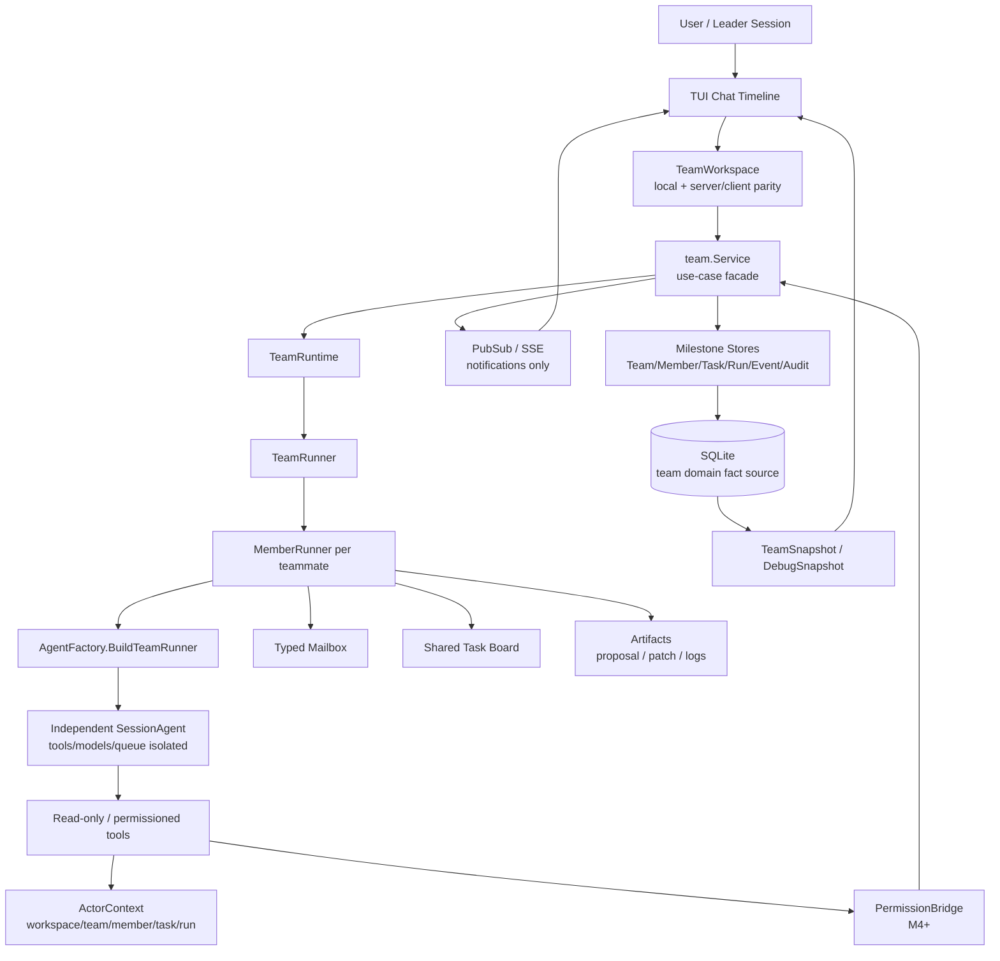
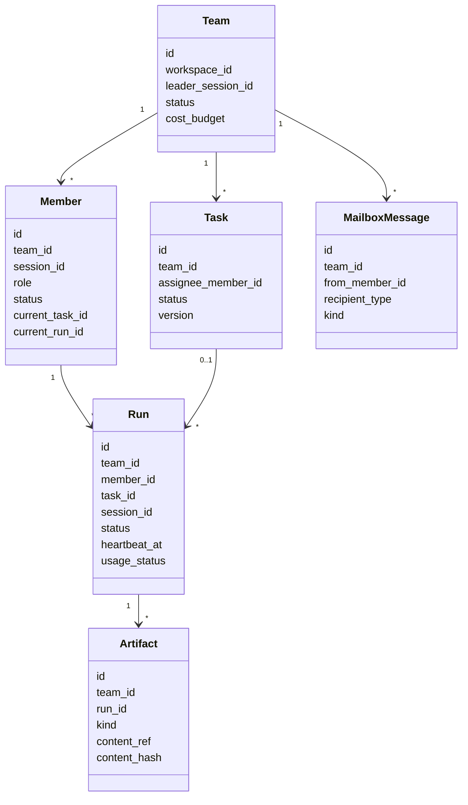
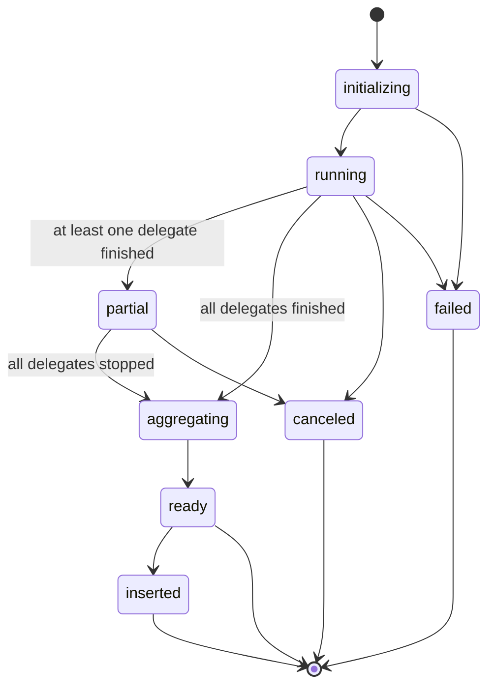
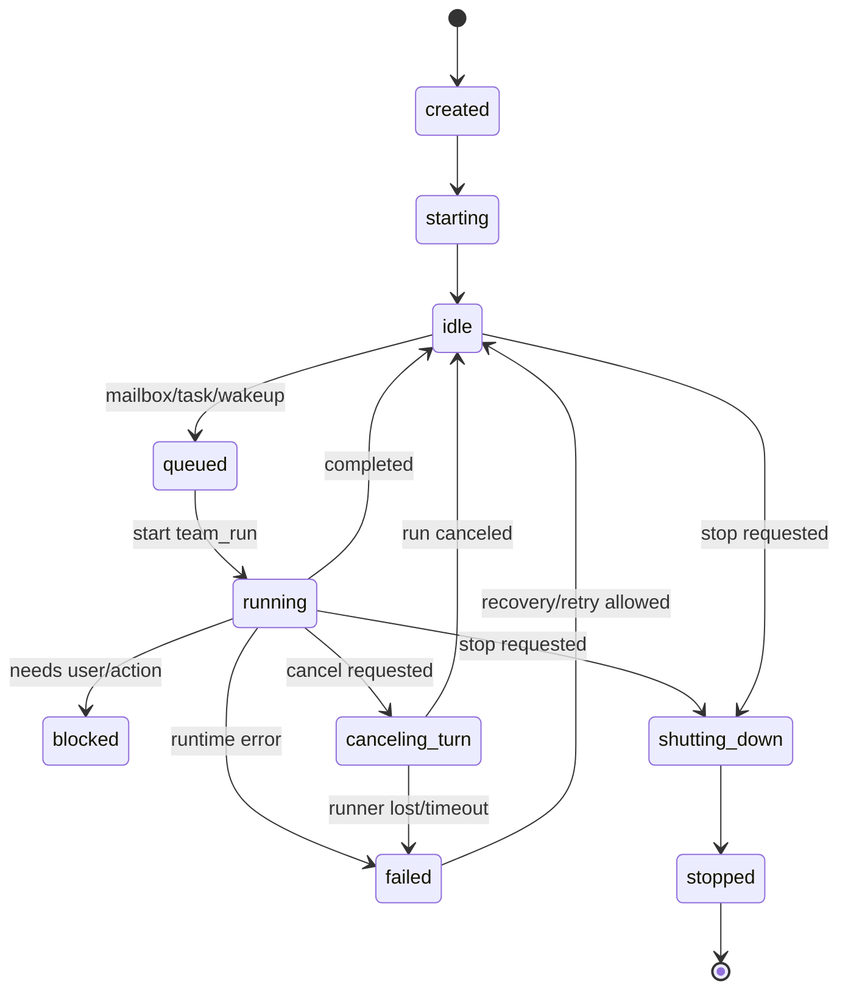
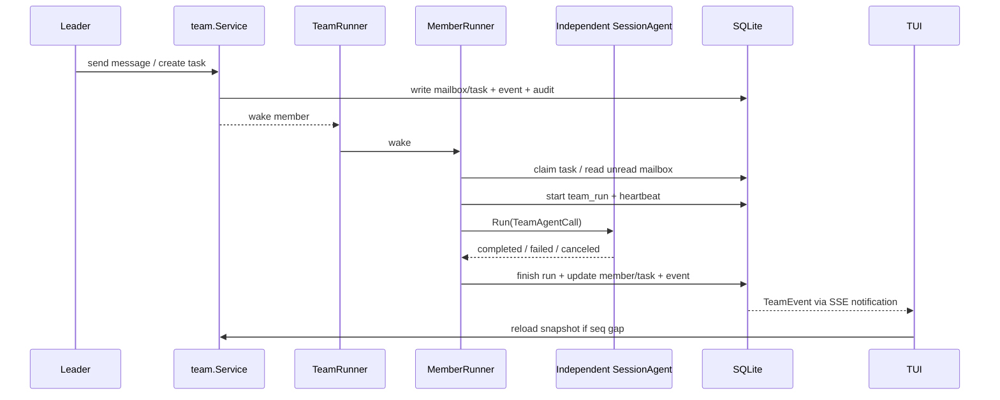
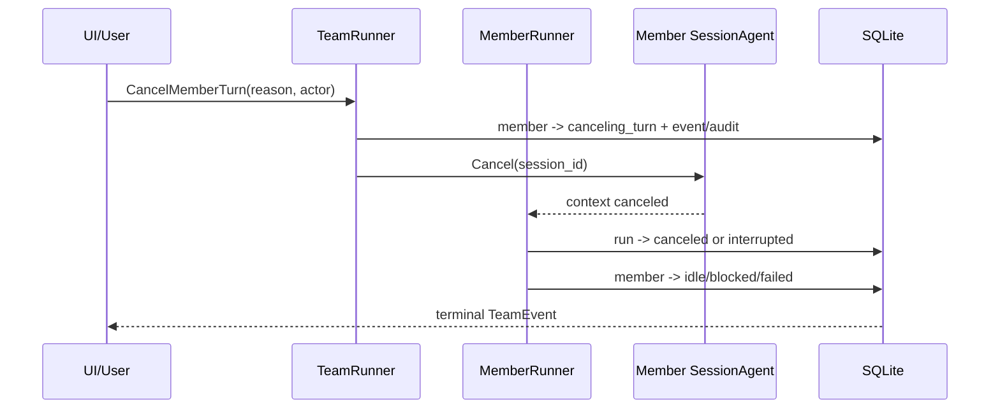
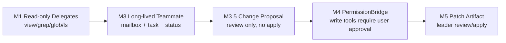

# 13 AgentTeam Mode 架构汇报稿

本文面向产品、部门经理和技术评审，解释 AgentTeam Mode 为什么这样设计、系统如何拆分、
智能体生命周期如何运行，以及每个阶段能交付什么。详细工程接口以 `00-12` 文档为准。

## 一句话结论

AgentTeam Mode 不是把多个聊天窗口简单并排启动，而是在现有 Crush coder agent 之外新增一个
可审计、可恢复、可分阶段开放权限的 team runtime。leader 负责创建和管理团队，teammate 通过
typed mailbox、shared task board 和 artifact 协作；所有长期状态由 durable team domain 记录。

## 设计目标

- 让复杂任务可以拆给多个 teammate 并行推进。
- 保持默认 coder 和旧 `/agent` 行为不变。
- 先做只读和可观察，再逐步开放长期 teammate、权限、写作业。
- 每个 teammate 有独立 session 和独立 `SessionAgent` runner，不共享 coder 的执行实例。
- team 状态以 SQLite 为事实源，SSE/pubsub 只做通知。
- M5 前 teammate 不直接写主工作区；M3.5 先产变更提案，M5 才产可 review/apply 的 patch artifact。

## 总体架构

关键分层：

| 层 | 责任 | 第一阶段边界 |
| --- | --- | --- |
| UI / Workspace | 展示 team 状态、触发 team action、处理 snapshot/event | 不直接读写 store |
| team.Service | 事务化业务用例，写 domain row + audit + event | M2 只做 core domain |
| TeamRuntime | 管理 TeamRunner / MemberRunner 生命周期 | M0.5 验证，M3 产品化 |
| MemberRunner | 长期 teammate runtime loop | 每次 wake 只跑一轮模型 |
| AgentFactory | 为 delegate/member 创建独立 runner | 不复用 `Coordinator.currentAgent` |
| PermissionBridge | team-aware 权限、审计、授权 scope | M4 才开放写工具 |
| ContentStore / Apply | patch 内容、hash、冲突和 apply | M5 才启用 |

## 为什么不是多个 Claude/Agent 进程

第一版选择 in-process TeamRunner，而不是直接启动多个外部进程，原因是：

- 更容易复用现有 session、tools、permission、UI、SSE 和 config。
- 可以用同一 SQLite domain 做恢复、审计、event replay。
- 能逐步开放权限，避免一开始就面对跨进程认证、A2A、worktree 和文件同步。
- M6 仍保留 worktree/process backend/A2A gateway，但作为后续 backend，而不是 MVP 内部协议。

## 核心对象关系

## 智能体生命周期

### M1 delegate 生命周期

M1 是最早可演示版本。它只创建一次性 read-only delegates，不创建 durable team runtime。

M1 产物不是“完整 team mode”，而是证明：

- leader 能并行派发只读调研。
- child session、actor identity、tool filtering、cancel/result aggregation 可以复用到 M3。
- 用户能看到 delegate 状态和结果来源。

### M3 long-lived teammate 生命周期

M3 才是真正长期 teammate。MemberRunner 大部分时间 idle，只有收到 mailbox、task、explicit wakeup
或 recovery wake 时才启动一轮 `team_run`。

### 一轮 teammate run

## 关键控制面

### 独立 runner ownership

每个 delegate/member runner 必须由 `AgentFactory.BuildTeamRunner` 创建新的 `SessionAgent` 实例。
不能复用 `Coordinator.currentAgent`，因为现有 `SessionAgent` 的 tools、models、messageQueue、
activeRequests 都是实例字段。共享实例会让工具策略、队列和 cancel 状态互相污染。

### cancel 合约

约束：

- cancel current turn 不清 mailbox/task queue。
- duplicate cancel 幂等。
- late Run result 不能覆盖 `canceled` / `interrupted` terminal state。
- M4 起 cancel 同时取消该 run 的 pending permission requests。

### 权限和写作业边界

## 阶段交付路线

| 里程碑 | 用户可见能力 | 技术交付 | 是否可演示 |
| --- | --- | --- | --- |
| M0/M0.5 | 无正式 UI | runtime spike、独立 runner、queued/cancel 验证 | 内部 debug |
| M1 | leader 派出只读 delegates 并聚合结果 | read-only policy、child transcript、delegate lifecycle | 是，最早演示 |
| M2 | debug team snapshot | DB/API/SSE/TeamService durable domain | 内部/技术演示 |
| M2.5 | 无直接感知 | server/client idempotency hardening | 技术验证 |
| M3 | 创建长期 teammate，收发消息，跑一轮 task | TeamRunner、MemberRunner、mailbox、scheduler、recovery | 是，真正 team loop |
| M3.5 | teammate 产变更提案 | change_proposal artifact + review UI | 是，实现型价值预览 |
| M4 | teammate 请求写权限 | PermissionBridge、audit、task board hardening | 是，受控写工具前置 |
| M5 | patch review/apply | ContentStore、hash、conflict、rollback、patch UI | 是，安全写作业 |
| M6 | worktree/process/A2A backend | external backend/gateway | 后续扩展 |

## 主要风险和控制

| 风险 | 控制方式 |
| --- | --- |
| 多 agent 互相污染上下文 | 不共享完整上下文，只用 typed mailbox/task/artifact |
| teammate 越权读写 | M1 read-only allow-list，M4 PermissionBridge，M5 patch review |
| 默认 coder 行为被破坏 | 旧 `/agent` 和 `Coordinator.currentAgent` 不变 |
| run/cancel/shutdown 状态不可解释 | team_runs、team_members、audit/event 事务化记录 |
| UI 收到乱序事件 | seq gap 后 reload TeamSnapshot |
| patch 覆盖用户修改 | base hash、pre-write recheck、per-path serialize guard、conflict artifact |
| 方案过早复杂化 | 每个里程碑只交付当阶段真实消费者需要的 store/API/UI |

## 审查重点

管理层审查建议关注三件事：

1. 分阶段路线是否符合产品节奏：M1 先演示并行调研，M3 再演示长期 teammate，M5 才写文件。
2. 安全边界是否足够可信：只读、权限、审计、patch review 是逐层打开的，不是一次性放权。
3. 工程复杂度是否可控：每个里程碑都有明确 hard gate，失败可以停在当前阶段，不会拖垮旧功能。
