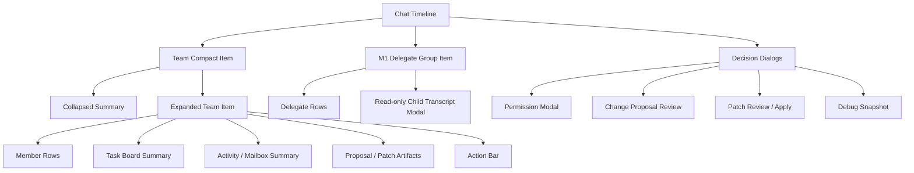
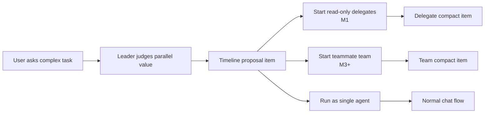
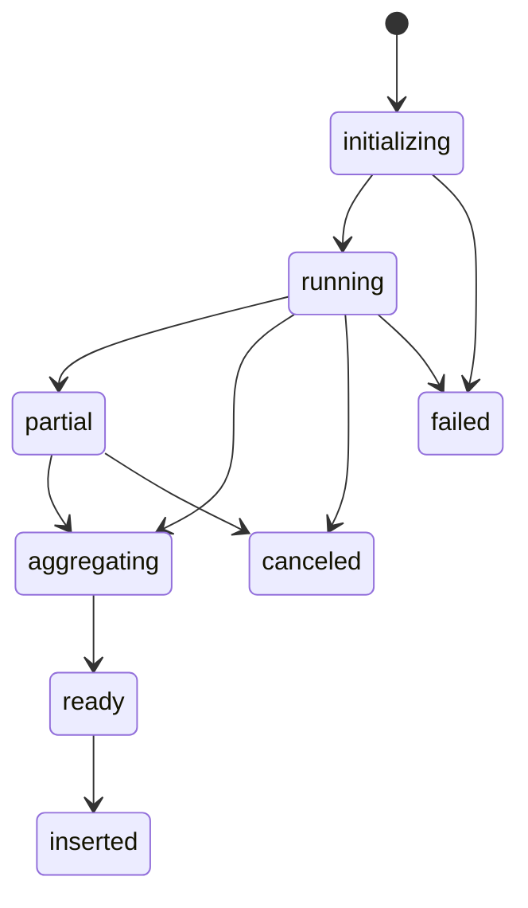
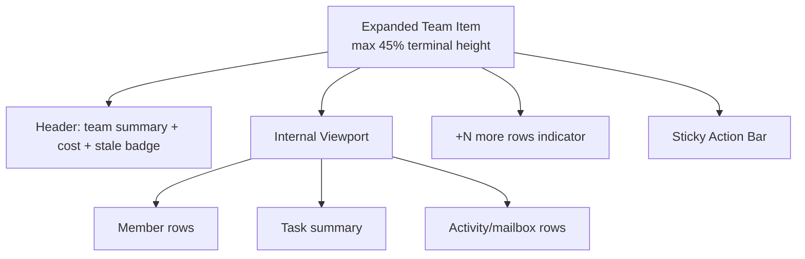
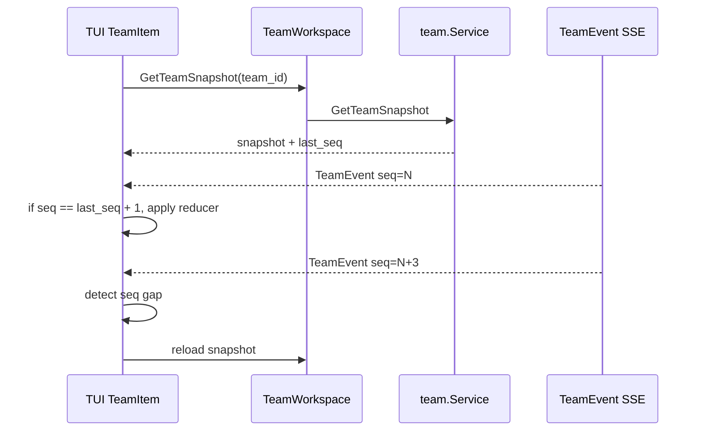
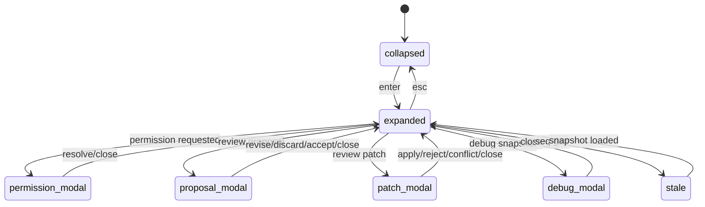

# 14 AgentTeam Mode UI 汇报稿

本文面向产品、部门经理和 UI 评审，解释 AgentTeam Mode 在 TUI 中如何出现、用户如何理解多个
teammate 的状态、什么时候需要用户决策，以及每个阶段的界面交付范围。详细工程实现以
`08-product-ui-observability.md` 为准。

## UI 目标

AgentTeam Mode 的 UI 不做复杂独立 IDE。第一版仍然以 chat timeline 为主，把 team 作为一个可折叠、
可展开、可追踪的 timeline item 呈现。用户需要一眼看懂：

- team 里有几个 teammate。
- 每个 teammate 在做什么，是否卡住。
- 当前任务、最近动作、成本和权限状态。
- 哪些结果可以插入、review、discard 或 apply。
- 出问题时能 reload snapshot、查看 audit/debug，而不是看到一串不可解释日志。

## 信息架构



设计原则：

- 第一屏仍然是聊天，不让用户进入新工作台。
- compact item 固定低高度，不挤压 chat。
- expanded item 有内部 viewport，内容多时内部滚动。
- action bar 固定在 expanded item 底部。
- permission、proposal、patch 这类决策使用 modal，避免在聊天流里误操作。

## 入口与发现



入口策略：

| 阶段 | 入口 | 用户认知 |
| --- | --- | --- |
| M1 | `Start read-only delegates` | 一次性并行调研，不会互相聊天，不会写文件 |
| M2 | debug snapshot command | 验证 team domain，不承诺真实协作 |
| M3+ | `Start teammate team` proposal | 创建长期 teammate，会持续显示状态 |

用户选择 `run as single agent` 后，本轮不再反复弹同一 proposal。

## M1 Delegate Preview UI

M1 是最早可演示版本。它的目标是让用户看到并行调研的过程和结果来源。

Collapsed:

```text
Delegates  partial  1 done / 2 running  $0.04  00:38
```

Expanded:

```text
name          state     elapsed  cost   note
researcher-a  running   00:21    $0.02  scanning parser
reviewer-b    done      00:34    $0.02  result ready
tester-c      failed    00:10    $0.00  denied .env

[open child transcript] [cancel all] [insert aggregated result] [copy trace]
```

Delegate lifecycle:



UI 规则：

- `partial` 时可查看已完成 child transcript，也可 cancel 仍在跑的 delegate。
- `aggregating` 时禁止重复 insert。
- `ready` 后 `insert aggregated result` 只能执行一次。
- child transcript 是只读 modal，不切换主 session，不显示输入框。

## M3 Compact Team Item

M3 是长期 teammate 的第一版真实演示。

Collapsed:

```text
Team parser-migration  1 running / 1 idle / 1 blocked  $0.23  last: researcher grep parser
```

Expanded:

```text
member       role        state             task       tool   elapsed  cost
researcher   analysis    running           task_12    grep   00:38    $0.05
tester       testing     idle              -          -      -        $0.02
writer       docs        blocked           task_14    write  01:12    $0.08

tasks: queued 3 / in progress 2 / blocked 1 / done 4
mailbox: researcher 0 unread / tester 2 unread / writer 1 unread

last events:
seq 42  researcher  task_claimed       task_12
seq 43  researcher  tool_started       grep
seq 44  writer      permission_needed  write docs/foo.md

[send message] [create task] [cancel member] [debug snapshot] [copy trace]
```

状态解释：

| 状态 | 用户理解 | 主要动作 |
| --- | --- | --- |
| `idle` | teammate 空闲，可接新消息/任务 | send message, create task |
| `running` | 正在跑一轮模型或工具 | inspect, cancel member |
| `blocked` | 需要用户授权、任务冲突或预算限制 | open permission/debug |
| `canceling_turn` | 正在取消当前 run | wait, force stop |
| `shutting_down` | 正在停止 teammate | wait, debug |
| `failed` | runtime 出错或恢复失败 | debug snapshot, retry/stop |

## Team Item 布局和滚动



约束：

- collapsed item 固定 1-2 行。
- expanded item 默认最大高度为可用终端高度 45%，低于 24 行终端时最大 10 行。
- 内部列表滚动时 action bar 不滚走。
- 焦点离开 team item 后恢复 chat timeline 滚动。
- modal 打开时，timeline 不响应 team item 快捷键。

## 数据流和恢复



Reducer 规则：

- `TeamSnapshotLoaded` 覆盖当前 item，并设置 `last_seq`。
- `TeamEventReceived.seq == last_seq + 1` 时增量更新。
- `seq <= last_seq` 忽略。
- `seq > last_seq + 1` 进入 `seq_gap`，触发 snapshot reload。
- unknown event 不崩溃，显示 activity 并请求 snapshot。

## 用户决策 Modal

### Permission Modal

M4 起展示 team-aware 权限请求。

```text
Permission request
team: parser-migration
member: writer
task: task_14 update docs
run: run_...
tool: write
path: docs/foo.md
reason: model-provided summary

[deny] [allow once] [allow for task] [advanced...]
```

规则：

- 默认焦点在最小授权或 deny，不默认扩大 scope。
- `allow once` 只对当前 tool call 生效。
- `allow for task` 创建 team-scoped grant，不写现有 session-wide persistent allow。
- late response 显示“请求已结束”，不能默默应用到新 run。

### Change Proposal Review

M3.5 提供实现型价值预览，但不写文件。

```text
Change proposal proposal_01          review only
member: writer
task: task_14
status: pending_review

files:
docs/foo.md        update API section     risk: low
internal/bar.go    adjust parser branch   risk: medium

pseudo diff:
@@ docs/foo.md
- current behavior summary
+ proposed behavior summary

suggested verification:
go test ./internal/parser/...

[request revision] [discard] [accept for patch] [copy proposal]
```

`accept for patch` 只改变 proposal 状态，不写 workspace，不调用 patch apply。M5 必须重新生成正式
`patch` artifact。

### Patch Review / Apply

M5 才开放。

```text
Patch patch_01  writer  task_14  base ok  3 files  +42 -8

[1/3] docs/foo.md        modify   +20 -3
[2/3] internal/bar.go    modify   +18 -5
[3/3] assets/logo.png    binary   review-only

@@ hunk 1/4
- old line
+ new line

[apply] [reject] [copy patch] [view verification]
```

安全提示：

- base mismatch 显示 conflict，不允许 apply。
- pre-write recheck mismatch 显示 no-write conflict。
- 多文件 apply rollback 失败时显示 partial apply conflict，需要人工处理。
- binary change 第一版 review-only，不允许 apply。

## UI 状态机总览



## 分阶段 UI 交付

| 里程碑 | UI 交付 | 汇报重点 |
| --- | --- | --- |
| M1 | Delegate compact item、只读 child transcript、聚合结果 | 最早演示，并行调研可见 |
| M2 | Team debug snapshot | 验证 durable domain 和 event replay |
| M3 | Team compact/expanded item、member rows、mailbox/activity、task summary | 真正长期 teammate loop |
| M3.5 | Change proposal review modal | 实现型协作价值，但不写文件 |
| M4 | Permission modal 扩展、permission queue、task board hardening | 受控放权和审计 |
| M5 | Patch review/apply modal、diff navigation、conflict state | 安全写作业 |

## 验收检查

产品和部门经理审查时建议看这些问题：

1. 用户是否能区分 M1 delegate、M3 teammate、M3.5 proposal、M5 patch。
2. 用户是否能在不看日志的情况下知道 teammate 当前状态和下一步动作。
3. 权限和写文件是否都需要明确用户决策。
4. UI 是否避免把聊天主流程挤成 dashboard。
5. 错误和恢复是否可解释：seq gap、snapshot reload、permission late、base mismatch、partial apply。

## 汇报建议

展示顺序建议：

1. 先展示 M1 delegate row，说明“最快能看到的价值”。
2. 再展示 M3 team item，说明“长期 teammate 的核心体验”。
3. 用 permission/proposal/patch 三个 modal 说明安全边界逐步开放。
4. 最后展示 snapshot/event recovery，说明这不是临时 demo，而是可恢复、可审计的产品能力。
