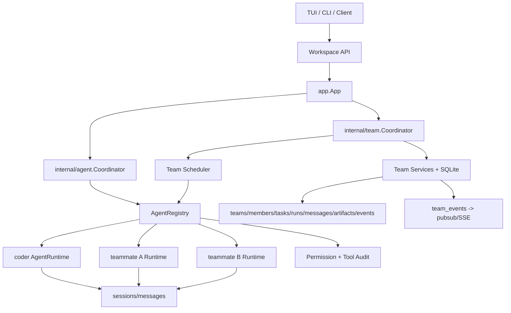
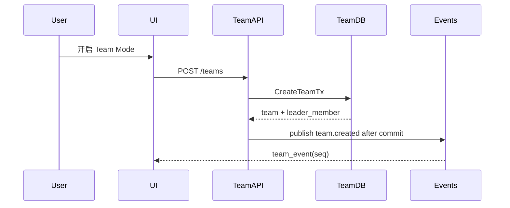
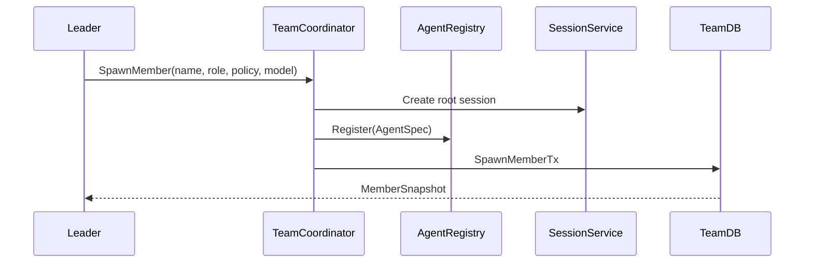
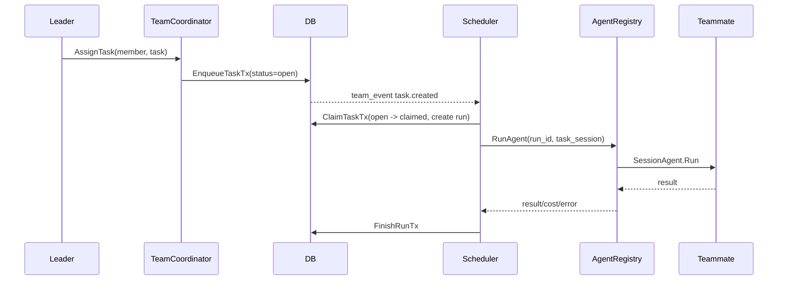

# Crush Agent Team Mode 深度技术调研与阶段设计

> 日期：2026-05-27  
> 仓库：`crush`  
> 分支：`codex/agent-team-research`  
> 目标：基于 Crush 当前架构，参考 Claude Code Agent Teams，设计一个可分阶段落地的多智能体 team mode。
> 拆分版历史设计：见 `docs/deprecated/agent-team-mode/README.md`。正式方案见 `docs/agent-team-mode/README.md`。

本文不是功能脑图，而是工程设计报告。核心问题包括：

- 如何在 Crush 内保持多个长期 agent。
- leader 如何创建、调度、取消、恢复多个 teammate。
- teammate 之间如何交互，是否像邮件，是否可以直接对话。
- 多 session 如何保持、恢复、重放。
- 为什么内部实现不直接采用 A2A 协议。
- 当前代码缺少哪些运行时、DB、协议、权限、隔离能力。
- 如何分阶段实现，避免一次性造一个复杂但不可控的分布式 agent 平台。

## 0. 多 subagent 辩证结论

本轮把设计拆成五个视角评审：

| 视角 | 主要关注 | 核心结论 |
| --- | --- | --- |
| Runtime Architect | `AgentCoordinator`、`SessionAgent`、`readyWg`、模型/工具构建 | registry 应放在 `internal/agent`，team 只调 runner；不能让 teammate 污染旧 `coder` 语义 |
| Protocol + DB Architect | SQLite schema、API、SSE replay、事务 | DB 是 source of truth；SSE 只能通知；不要把 ephemeral workspace id 持久化 |
| Scheduler + Isolation Engineer | 队列、run 状态、cancel/pause/retry、写隔离 | 不要复用现有 `messageQueue` 做 team scheduler；需要 durable task/run/lease |
| Security + Permission Auditor | permission、hooks、MCP、skills、tool audit | 先补 ActorContext、scoped grant、ToolExecutionEvent；read-only 也不是安全边界 |
| Skeptical Reviewer | 产品风险、复杂度、MVP 范围 | 第一阶段不要上完整 team runtime；先做 parallel delegates/team preview 验证价值 |

辩证后的主判断：

1. **长期方向**：Crush 应做本地 actor-style TeamRuntime。leader 和 teammate 都是本地 agent actor，共享 workspace，但不共享完整上下文；协作通过 task、message、artifact、event 进行。
2. **短期路线**：不要从完整 Claude Code Team Mode 复制起步。先做 read-only parallel delegates，验证“多个 teammate 同时调研并汇报给 leader”确实有价值。
3. **关键底座**：多 agent 不是多开 goroutine 就够了。必须补 `AgentRegistry`、`team_runs`、`team_events`、actor-aware permission、workspace-scoped read-only、cancel registry。
4. **交互方式**：teammate 间交互可以类比邮件，但工程上应是 typed mailbox：有 sender、receiver、task/run 归因、receipt、idempotency、event replay，不是把文本塞进对方 prompt。
5. **A2A 定位**：A2A 适合跨产品、跨进程、跨组织的外部 agent 互操作，不适合作为 Crush 内部 scheduler/mailbox 的第一层协议。可以后置为 gateway。
6. **写作业隔离**：第一版 teammate 默认只读。第一个写阶段应是 patch artifact，让 leader apply；之后才是 file lease 和 git worktree。

## 1. 外部参照：Claude Code Agent Teams

官方文档显示，Claude Code Agent Teams 仍是 experimental，默认关闭，需要启用配置项；文档还明确列出 session resumption、task coordination、shutdown、resource consumption 等限制。来源：

- Claude Code Agent Teams 文档：<https://code.claude.com/docs/en/agent-teams>

可借鉴的是抽象，不是实现细节：

| 抽象 | Claude Code 语义 | Crush 推荐语义 |
| --- | --- | --- |
| Team | 一组协作 agent | SQLite `teams` + `team_members` |
| Leader | 用户当前交互的 Claude Code | 当前 `coder` agent + top-level session |
| Teammate | 独立 context 的 agent | 独立 `AgentRuntime` + root/task sessions |
| Task list | 共享任务板，支持 claim/dependency | `team_tasks` + dependency table |
| Mailbox | teammate 之间通过 mailbox 通信 | `team_messages` + receipts + replay |
| Direct message | 可发给指定 teammate | `to_member_id` message |
| 多 session | teammate 有独立 conversation | `sessions.parent_session_id` + `team_session_links` |
| 权限 | leader/user 授权 teammate 动作 | actor-aware permission grant |
| 展示 | in-process 或 split panes | TUI team panel，后续可加 split/worktree |

需要谨慎的地方：

- Claude Code 当前已经承认 in-process team 的 resume 不完整。Crush 不应承诺恢复 goroutine 或 LLM stream，只能恢复 durable task/run。
- Claude Code 的 mailbox/task coordination 可以看作产品语义，不代表 Crush 必须用文件 mailbox。Crush 已有 SQLite、server、SSE，DB-first 更自然。
- Claude Code 的多个 teammate 不是“一个 prompt 里的多个角色扮演”，而是多个独立 agent context。Crush 也应避免把 team mode 做成单 session 里的角色标签。

## 2. 为什么不直接用 A2A

A2A 是 Agent2Agent 外部互操作协议，目标是让不同 agent 系统通过标准协议发现能力、交换 task/message/artifact、进行远程协作。官方站点：<https://a2a-protocol.org/latest/>

它和 Crush 内部 team runtime 的边界不同：

| 维度 | A2A 更适合 | Crush 内部 team 更需要 |
| --- | --- | --- |
| 调用边界 | 跨进程、跨网络、跨 vendor | 同一 workspace 内低延迟调度 |
| 身份 | remote agent card / external identity | member/session/run/tool 细粒度归因 |
| 状态 | protocol-level task/message/artifact | SQLite transaction + local recovery |
| 权限 | 外部 agent 信任与 capability | 本地文件、shell、MCP、skills 的用户授权 |
| 事件 | 远程 streaming/notification | 本地 SSE + DB event replay |
| 调度 | remote task exchange | 本地 queue、lease、cancel registry、worktree |

结论：

- **P0-P3 不用 A2A 做内部协议**。否则要先解决 agent card、auth、transport、remote task lifecycle，却还没解决本地文件权限、session 归因、message replay。
- **P4/P5 可做 A2A gateway**。当 Crush 本地已有 `TeamTask`、`TeamMessage`、`TeamArtifact` 后，可以把外部 A2A task 映射进本地 team task，也可以把某个 teammate 暴露成 remote agent。
- **内部模型可以借鉴 A2A 的名词**：task、message、artifact、status、capability，但落库和调度必须按 Crush 本地事实源设计。

## 3. Crush 当前调用链与关键事实

### 3.1 用户输入到 agent run

TUI 本地模式：

```text
internal/ui/model/ui.go
  sendMessage(...)
    -> Workspace.CreateSession(...)
    -> Workspace.AgentRun(...)

internal/workspace/app_workspace.go
  AppWorkspace.AgentRun(...)
    -> app.AgentCoordinator.Run(...)
```

Client/server 模式：

```text
internal/workspace/client_workspace.go
  ClientWorkspace.AgentRun(...)
    -> client.SendMessage(...)

internal/client/proto.go
  POST /v1/workspaces/{id}/agent

internal/server/server.go
  route POST /v1/workspaces/{id}/agent

internal/server/proto.go
  handlePostWorkspaceAgent(...)

internal/backend/agent.go
  backend.SendMessage(...)
    -> ws.AgentCoordinator.Run(...)
```

CLI non-interactive：

```text
internal/app/app.go
  RunNonInteractive(...)
    -> app.AgentCoordinator.Run(...)
```

当前外部协议只传 `SessionID + Prompt + Attachments`，没有 `agent_id/team_id/member_id/task_id/run_id`。因此现在的 `/agent` API 天然表示“让默认 coder agent 跑一次”，不是多 agent 路由。

### 3.2 `AgentCoordinator` 是隐式 singleton

关键文件：`internal/agent/coordinator.go`

当前结构：

```go
type coordinator struct {
    currentAgent SessionAgent
    agents       map[string]SessionAgent
    readyWg      errgroup.Group
}
```

事实：

- `NewCoordinator` 只构建 `config.AgentCoder`。
- `Run` 总是调用 `c.currentAgent.Run(...)`。
- `Cancel`、`IsBusy`、`Model`、`QueuedPrompts` 也都隐式看 `currentAgent`。
- `agents map[string]SessionAgent` 已预留，但不是 registry，没有 status、ready gate、spec、policy、cancel scope。
- `readyWg` 是 coordinator 级全局 barrier。team mode 下如果某个 teammate 工具构建失败，不能阻塞所有 agent。

设计含义：

- 不能简单把 teammate 塞进现有 `agents map`，否则旧 UI 的 busy/model/queue 语义会被 teammate 污染。
- 应把 `currentAgent` 重构为 `defaultAgentID = "coder"`，旧接口仍只指向 coder。
- 新增 `RunAgent(ctx, AgentRunRequest)`，team scheduler 只走新接口。
- `readyWg` 必须迁移为 per-agent `ReadyGate`。

### 3.3 `SessionAgent` 不是 durable scheduler

关键文件：`internal/agent/agent.go`

当前 `SessionAgent.Run` 语义：

- 以 `sessionID` 为 active request key。
- 如果 `IsSessionBusy(sessionID)`，把 call append 到内存 `messageQueue[sessionID]` 后返回。
- `activeRequests[sessionID]` 在读取 session/messages、创建 user message 之后才设置。
- `PrepareStep` 会把 queue 里的 prompt 合并进当前模型 step。
- run 结束后如果 queue 还有内容，会递归 `Run`。

风险：

- `activeRequests` 不是严格 mutex。两个同 session 并发 run 可能都在 activeRequests 设置前通过 busy 检查。
- `messageQueue` 不是 durable queue，也不是事务；`Get -> append -> Set` 不是原子队列。
- queue 不是严格 FIFO 的“每个 prompt 一轮 run”，它可能被合并进当前 LLM step。
- `Cancel(sessionID)` 只能取消 session 当前 active request，并清 queue；team 需要按 `run_id` 取消。

设计含义：

- 不要复用 `SessionAgent.messageQueue` 做 team scheduler。
- team task/run 状态必须落 SQLite。
- 内存只保存 `run_id -> cancel func` 这种可丢失 runtime cache。
- 每个 teammate task run 应使用独立 task session，避免 root session 多任务互相误伤。

### 3.4 现有 `agent` tool 是临时 sub-agent，不是 teammate

关键文件：

- `internal/agent/agent_tool.go`
- `internal/agent/coordinator.go`
- `internal/session/session.go`

现有 `agent` tool：

- 是某个 tool call 生命周期内创建的 child session。
- session id 形如 `messageID$$toolCallID`。
- `parent_session_id` 指向调用者 session。
- 默认 read-only 工具，适合单次调研。
- `NonInteractive: true`，结束后把结果返回给调用者。

它缺少：

- 长期身份：没有 member id。
- 可寻址性：leader 不能后续对它发消息。
- durable run：没有 task/run 表。
- team task board：没有 claim/dependency/status。
- peer mailbox：不能与其他 sub-agent 交互。
- 独立权限 scope：permission 只知道 session/tool。

因此它可以作为 P0 parallel delegate 的基础，但不能直接等价为 team mode。

### 3.5 SQLite 现状

关键文件：

- `internal/db/migrations`
- `internal/db/sql`
- `sqlc.yaml`

已有表：

- `sessions`
- `messages`
- `files`
- `read_files`

已有有利条件：

- 每个 workspace 有 SQLite。
- goose migration + sqlc。
- `sessions.parent_session_id` 已存在。
- SQLite WAL、foreign key、busy timeout、单连接事务模型适合本地一致性。

缺口：

- 没有 team/member/task/run/message/artifact/event 表。
- 没有 durable outbox。
- session/message 没有 team attribution。
- read_files 只有 session/path/read_at，缺少 hash/blob oid，不能承载多 agent 写冲突检测。

### 3.6 Pubsub/SSE 不是事实源

当前 app/server 用 pubsub 和 SSE 推送 session/message/permission 等事件。它适合 UI 刷新，不适合做 team mailbox 的唯一载体。

原因：

- pubsub delivery 可丢。
- SSE reconnect 需要 replay。
- 多 client 需要 snapshot + since cursor。
- team mode 需要跨进程重启后恢复状态。

设计含义：

- `team_events` 是 append-only 事实源。
- 状态表和 event 表必须在同一个 SQLite transaction 写入。
- commit 后再 publish SSE。
- client 断线后：`GET /snapshot` + `GET /events?since_seq=` + 重新订阅。

### 3.7 Permission/Hook 当前只适合单 agent

关键文件：

- `internal/permission/permission.go`
- `internal/agent/hooked_tool.go`
- `internal/agent/tools/*`

当前 `PermissionRequest` 只有：

```go
SessionID
ToolCallID
ToolName
Description
Action
Params
Path
```

当前持久授权 key：

```go
SessionID + ToolName + Action + Path
```

风险：

- UI 无法回答“哪个 teammate、哪个 task、哪个 run 发起权限请求”。
- `allow_session` 对 teammate 后续任务过宽。
- `hook allow` 会跳过权限弹窗，缺少 actor 归因。
- sub-agent 内部工具默认不跑 hook。
- 很多 read-only 工具不产生 permission request，例如 `grep/glob/sourcegraph/job_output/lsp_*`。
- MCP tool 有 AllowedMCP 过滤，但 MCP server instructions 当前会注入所有 connected server instructions。
- skills metadata 默认会注入 prompt，teammate 可见性没有单独控制。

设计含义：

- team mode 之前必须先设计 `ActorContext`。
- permission 只是审批流，不是审计流。需要 `ToolExecutionEvent` 覆盖所有工具。
- read-only teammate 必须是 workspace-scoped read-only，不是“所有读工具随便用”。

## 4. 目标模型：不是多角色 prompt，而是多 agent actor

### 4.1 概念定义

| 概念 | 含义 | 持久化 |
| --- | --- | --- |
| Team | 一个协作空间，绑定当前 workspace | `teams` |
| Leader | 用户当前交互 agent，默认 coder | `team_members(role=leader)` |
| Teammate | 被 leader 创建的长期 agent actor | `team_members(role=teammate)` |
| AgentRuntime | 内存中的可运行 agent 实例 | `internal/agent` registry |
| Root Session | teammate 的长期记忆/身份 session | `sessions` + `team_session_links` |
| Task Session | 某个 task attempt 的执行 transcript | `sessions` + `team_session_links` |
| Task | 可分配、可 claim、可依赖的工作单元 | `team_tasks` |
| Run | 某个 member 对某个 task 的一次 attempt | `team_runs` |
| Team Message | mailbox 消息、result、review、question | `team_messages` |
| Artifact | patch、report、log、diff、test result | `team_artifacts` |
| Team Event | 状态变化 event outbox | `team_events` |
| ActorContext | tool/permission/hook/audit 的调用身份 | context + proto + DB |

### 4.2 全局架构



关键原则：

- `internal/agent` 负责“怎么构建和运行 agent”。
- `internal/team` 负责“team 业务生命周期”。
- `agent` 不 import `team`，避免循环依赖。
- `team` 依赖窄接口 `AgentRegistry/AgentRunner`。
- 旧 `/agent` 永远代表默认 coder，不变成多 agent 万能入口。

## 5. 模块设计一：`internal/agent` 的 AgentRegistry

### 5.1 为什么 registry 应放在 `internal/agent`

`buildAgent`、`buildTools`、`buildProvider`、`buildAgentModels`、skills、MCP tool 构建等逻辑都在 `internal/agent/coordinator.go`，且大量依赖 agent 包私有类型。

如果把 registry 放进 `internal/team`：

- team 包需要窥探 agent 私有构造逻辑。
- 容易形成 import cycle。
- 后续模型刷新、MCP refresh、tool policy 都会绕远路。

因此：

- `internal/agent` 新增 `AgentRegistry`、`AgentRuntime`、`AgentBuilder`。
- `internal/team` 只调用 `AgentRunner`。

### 5.2 建议接口

```go
type AgentSpec struct {
    ID           string
    Name         string
    Role         string // coder, leader, teammate, subagent
    Prompt       string
    Model        config.SelectedModel
    SmallModel   config.SelectedModel
    ToolPolicy   ToolPolicy
    MCPPolicy    MCPPolicy
    SkillPolicy  SkillPolicy
}

type AgentRunContext struct {
    WorkspaceID     string
    TeamID          string
    AgentID         string
    AgentName       string
    AgentRole       string
    MemberID        string
    TaskID          string
    RunID           string
    ParentSessionID string
    SessionID       string
    CallerChain     []ActorRef
}

type AgentRunRequest struct {
    AgentID     string
    SessionID   string
    Prompt      string
    Attachments []message.Attachment
    Context     AgentRunContext
}

type AgentRuntime struct {
    ID      string
    Spec    AgentSpec
    Agent   SessionAgent
    Ready   ReadyGate
    Status  csync.Value[AgentStatus]
}

type AgentRegistry interface {
    Register(ctx context.Context, spec AgentSpec) (*AgentRuntime, error)
    Get(agentID string) (*AgentRuntime, bool)
    List() []*AgentRuntime
    Refresh(ctx context.Context, agentID string) error
    RunAgent(ctx context.Context, req AgentRunRequest) (*fantasy.AgentResult, error)
    CancelRun(runID string)
    CancelSession(agentID, sessionID string)
    CancelAll()
}
```

### 5.3 对旧 `Coordinator` 的兼容

旧接口保留：

```go
Run(ctx, sessionID, prompt, attachments...)
Cancel(sessionID)
IsBusy()
IsSessionBusy(sessionID)
QueuedPrompts(sessionID)
Model()
UpdateModels(ctx)
```

兼容策略：

- `Run` 等价于 `RunAgent(AgentID: "coder")`。
- `IsBusy/Model/QueuedPrompts` 默认只看 coder，避免 teammate busy 导致旧 UI 误判。
- `Cancel(sessionID)` 只取消 coder 的 session。
- `CancelAll()` 必须取消 registry 全部 runtime，因为 app shutdown 要停止所有 active run。

### 5.4 必须拆掉的 singleton 细节

| 当前点 | 风险 | 改法 |
| --- | --- | --- |
| `currentAgent` | 所有调用隐式走 coder | 改为 `defaultAgentID` |
| `agents map[string]SessionAgent` | 没 status/spec/ready/cancel | 升级为 `AgentRegistry` |
| coordinator 级 `readyWg` | teammate 构建失败会污染全局 | per-agent `ReadyGate` |
| `buildAgentModels(ctx, isSubAgent)` | 模型只读全局 large/small | 改为 `buildAgentModels(ctx, spec)` |
| `buildTools(ctx, agent, isSubAgent)` | 没 actor/team policy | 改为 `ToolBuildOptions` |
| MCP instructions 全局注入 | teammate 看到不该看的 MCP server instructions | 按 `MCPPolicy` 过滤 |
| skills prompt 全局注入 | teammate 看到全局/user skill metadata | 按 `SkillPolicy` 过滤 |

## 6. 模块设计二：`internal/team` 的 TeamCoordinator

### 6.1 包边界

建议新增：

```text
internal/team/
  coordinator.go
  scheduler.go
  service_team.go
  service_member.go
  service_task.go
  service_message.go
  service_artifact.go
  service_event.go
  recovery.go
  policy.go
  types.go
```

职责：

- 管理 team/member/task/message/run/artifact/event 生命周期。
- 调用 `agent.AgentRegistry` 创建 teammate runtime。
- 调度 queued task 到 member。
- 维护 durable status。
- 处理 cancel/pause/resume/retry/recover。
- 将 team event 写入 DB，并 publish SSE。

它不负责：

- 直接构建 LLM provider。
- 直接构建 tool list。
- 修改旧 `/agent` 语义。

### 6.2 TeamRuntime 给 agent tool 的窄接口

如果 leader 需要通过工具创建 teammate/分配任务，`agent` 包不能 import `team`。可以在 `internal/agent` 定义窄接口：

```go
type TeamToolRuntime interface {
    CreateTeam(ctx context.Context, req TeamCreateRequest) (TeamSnapshot, error)
    SpawnMember(ctx context.Context, req SpawnMemberRequest) (MemberSnapshot, error)
    AssignTask(ctx context.Context, req AssignTaskRequest) (TaskSnapshot, error)
    SendMessage(ctx context.Context, req TeamMessageRequest) error
    CancelRun(ctx context.Context, req CancelRunRequest) error
}
```

`internal/team.Coordinator` 实现该接口。

`app.New` 初始化顺序：

```text
create db/services
create AgentCoordinator
create TeamCoordinator(agentRegistry, team services)
AgentCoordinator.SetTeamRuntime(teamCoordinator)
```

### 6.3 leader 如何创建和管控 teammate

leader 的控制能力应分层：

| 操作 | P0 | P1+ |
| --- | --- | --- |
| 创建 team | UI/API 显式创建 | leader tool 可创建 |
| 创建 teammate | 固定 1-3 个 read-only delegate | `team_members` + runtime register |
| 分配任务 | leader 发 parallel delegate prompt | `team_tasks` queued |
| 查看状态 | 简单 run group status | team snapshot + events |
| 取消 | cancel run group | cancel by `run_id` |
| 暂停 | 不支持或停止新任务 | pause team/member/task |
| 恢复 | 不承诺 | recover interrupted task/run |
| 删除 | 清 runtime | archive team/member |

leader 不应直接拿到 teammate 的完整上下文。leader 看到的是：

- teammate status。
- task progress。
- result message。
- artifact。
- permission request。
- tool audit summary。

## 7. 模块设计三：DB schema 与事务

### 7.1 原则

- 不把 runtime `workspace_id` 持久化。workspace id 可能是 server 运行时概念，DB 文件本身已经绑定 workspace。
- 不第一时间修改 `sessions/messages`。用 link table 做 team attribution，降低迁移风险。
- 状态表和 event outbox 同事务写入。
- 所有关键写操作带 idempotency key，避免 SSE/API retry 造成重复任务或重复消息。

### 7.2 表设计

```sql
CREATE TABLE teams (
    id TEXT PRIMARY KEY,
    name TEXT NOT NULL,
    description TEXT,
    status TEXT NOT NULL,
    leader_session_id TEXT,
    leader_member_id TEXT,
    metadata_json TEXT NOT NULL DEFAULT '{}',
    created_at INTEGER NOT NULL,
    updated_at INTEGER NOT NULL,
    archived_at INTEGER
);

CREATE TABLE team_members (
    id TEXT PRIMARY KEY,
    team_id TEXT NOT NULL,
    agent_id TEXT NOT NULL,
    name TEXT NOT NULL,
    role TEXT NOT NULL,
    status TEXT NOT NULL,
    model_provider TEXT,
    model_id TEXT,
    model_type TEXT,
    root_session_id TEXT,
    current_task_id TEXT,
    current_run_id TEXT,
    tool_policy_json TEXT NOT NULL DEFAULT '{}',
    capabilities_json TEXT NOT NULL DEFAULT '{}',
    last_seen_at INTEGER,
    created_at INTEGER NOT NULL,
    updated_at INTEGER NOT NULL,
    stopped_at INTEGER,
    FOREIGN KEY (team_id) REFERENCES teams(id) ON DELETE CASCADE,
    UNIQUE(team_id, agent_id),
    UNIQUE(team_id, name)
);

CREATE TABLE team_tasks (
    id TEXT PRIMARY KEY,
    team_id TEXT NOT NULL,
    parent_task_id TEXT,
    title TEXT NOT NULL,
    description TEXT NOT NULL,
    status TEXT NOT NULL,
    priority INTEGER NOT NULL DEFAULT 0,
    created_by_member_id TEXT,
    assigned_member_id TEXT,
    lease_owner_member_id TEXT,
    lease_token TEXT,
    lease_until INTEGER,
    result_run_id TEXT,
    result_message_id TEXT,
    error TEXT,
    metadata_json TEXT NOT NULL DEFAULT '{}',
    created_at INTEGER NOT NULL,
    updated_at INTEGER NOT NULL,
    started_at INTEGER,
    completed_at INTEGER,
    FOREIGN KEY (team_id) REFERENCES teams(id) ON DELETE CASCADE
);

CREATE TABLE team_task_dependencies (
    task_id TEXT NOT NULL,
    depends_on_task_id TEXT NOT NULL,
    PRIMARY KEY(task_id, depends_on_task_id)
);

CREATE TABLE team_runs (
    id TEXT PRIMARY KEY,
    team_id TEXT NOT NULL,
    task_id TEXT NOT NULL,
    member_id TEXT NOT NULL,
    session_id TEXT,
    trigger_message_id TEXT,
    status TEXT NOT NULL,
    attempt INTEGER NOT NULL DEFAULT 1,
    model_provider TEXT,
    model_id TEXT,
    prompt_tokens INTEGER NOT NULL DEFAULT 0,
    completion_tokens INTEGER NOT NULL DEFAULT 0,
    cost REAL NOT NULL DEFAULT 0,
    deadline_at INTEGER,
    heartbeat_at INTEGER,
    error TEXT,
    metadata_json TEXT NOT NULL DEFAULT '{}',
    created_at INTEGER NOT NULL,
    updated_at INTEGER NOT NULL,
    started_at INTEGER,
    finished_at INTEGER,
    FOREIGN KEY (team_id) REFERENCES teams(id) ON DELETE CASCADE,
    FOREIGN KEY (task_id) REFERENCES team_tasks(id) ON DELETE CASCADE
);

CREATE TABLE team_messages (
    id TEXT PRIMARY KEY,
    team_id TEXT NOT NULL,
    task_id TEXT,
    run_id TEXT,
    from_member_id TEXT,
    to_member_id TEXT,
    kind TEXT NOT NULL,
    body TEXT NOT NULL,
    payload_json TEXT NOT NULL DEFAULT '{}',
    idempotency_key TEXT,
    created_at INTEGER NOT NULL,
    updated_at INTEGER NOT NULL,
    FOREIGN KEY (team_id) REFERENCES teams(id) ON DELETE CASCADE,
    UNIQUE(team_id, idempotency_key)
);

CREATE TABLE team_message_receipts (
    message_id TEXT NOT NULL,
    member_id TEXT NOT NULL,
    delivered_at INTEGER,
    read_at INTEGER,
    ack_at INTEGER,
    PRIMARY KEY(message_id, member_id)
);

CREATE TABLE team_artifacts (
    id TEXT PRIMARY KEY,
    team_id TEXT NOT NULL,
    task_id TEXT,
    run_id TEXT,
    created_by_member_id TEXT,
    kind TEXT NOT NULL,
    title TEXT NOT NULL,
    uri TEXT,
    path TEXT,
    mime_type TEXT,
    content_text TEXT,
    content_hash TEXT,
    size_bytes INTEGER,
    metadata_json TEXT NOT NULL DEFAULT '{}',
    created_at INTEGER NOT NULL
);

CREATE TABLE team_events (
    seq INTEGER PRIMARY KEY AUTOINCREMENT,
    id TEXT NOT NULL UNIQUE,
    team_id TEXT NOT NULL,
    type TEXT NOT NULL,
    entity_type TEXT NOT NULL,
    entity_id TEXT NOT NULL,
    actor_member_id TEXT,
    task_id TEXT,
    run_id TEXT,
    message_id TEXT,
    correlation_id TEXT,
    idempotency_key TEXT,
    payload_json TEXT NOT NULL DEFAULT '{}',
    created_at INTEGER NOT NULL
);

CREATE TABLE team_session_links (
    team_id TEXT NOT NULL,
    member_id TEXT,
    task_id TEXT,
    run_id TEXT,
    session_id TEXT NOT NULL,
    role TEXT NOT NULL,
    created_at INTEGER NOT NULL,
    PRIMARY KEY(team_id, session_id, role)
);
```

### 7.3 关键事务

| 事务 | 必须同事务完成 |
| --- | --- |
| `CreateTeamTx` | insert team、leader member、session link、team event |
| `SpawnMemberTx` | insert member、root session、session link、event |
| `EnqueueTaskTx` | insert task、可选 message、receipts、event |
| `ClaimTaskTx` | atomic update task lease、insert run queued、event |
| `StartRunTx` | run queued -> running，记录 session/deadline/heartbeat，event |
| `PermissionWaitTx` | run/member -> waiting_permission，event |
| `FinishRunTx` | update run/task/member，insert result message/artifact/event |
| `CancelRunTx` | mark cancel_requested/canceling，event |
| `RecoverTx` | stale running -> interrupted，按 retry policy requeue |

注意：

- LLM 调用不能放在 DB transaction 内。
- permission 等用户审批时不能持有 DB transaction。
- SSE publish 必须发生在 commit 之后。
- `ClaimTaskTx` 要用 lease token，避免两个 worker 同时 claim。

## 8. 模块设计四：Scheduler 状态机

### 8.1 Task state

```text
open
  -> claimed
  -> running
  -> waiting_permission
  -> completed

open/running
  -> paused
  -> open

running
  -> retry_wait
  -> open

running
  -> blocked
  -> failed
  -> canceled
```

语义：

- `open`：可被 scheduler claim。
- `claimed`：已经拿到 lease，但 run 还未开始。
- `running`：对应 `team_runs.status=running`。
- `waiting_permission`：run 在等用户审批，不能被当作卡死。
- `retry_wait`：失败后等待 backoff。
- `blocked`：依赖未完成或冲突未解决。
- `completed`：有 result run/message/artifact。

### 8.2 Run state

```text
queued
  -> starting
  -> running
  -> streaming
  -> waiting_tool
  -> waiting_permission
  -> completed

running/waiting_tool/waiting_permission
  -> cancel_requested
  -> canceled

running
  -> timed_out
  -> retry_wait

running
  -> interrupted
```

Run 是 attempt，不是 task 本身。retry 必须创建新的 attempt 或至少递增 attempt 并保留 artifact。

### 8.3 Member state

```text
starting
  -> idle
  -> running
  -> waiting_permission
  -> paused
  -> stopping
  -> stopped

starting/running
  -> failed
```

`member.status` 用于 UI 和调度，不应从 `SessionAgent.IsBusy` 推导。

### 8.4 Cancel / pause / resume / retry / timeout

Cancel：

- DB 先标记 `team_runs.status=cancel_requested`。
- 查 `runCancelRegistry[run_id]` 调 cancel func。
- `SessionAgent.Cancel(sessionID)` 只能作为兼容 fallback。
- cancel 完成后标 `canceled`，释放 task lease/file lease。

Pause：

- 普通 pause：停止调度新 run，当前 run 可自然结束。
- 强 pause：cancel 当前 run，task 标 `paused`。

Resume：

- 清 pause flag。
- task `paused -> open`。
- scheduler 重新 claim，创建新的 run attempt。
- 不承诺恢复旧 goroutine 或 LLM stream。

Retry：

- 只对 `failed/timed_out/interrupted` 生效。
- 检查 `attempt < max_attempts`。
- 写 `retry_wait` 和 backoff。
- artifact 按 attempt 保留。

Timeout：

- run 写 `deadline_at`。
- 执行时用 `context.WithTimeout` 包 `RunAgent`。
- 超时后 DB 以 `timed_out` 为准。
- 后台 shell job 必须绑定 owner `run_id`，timeout 时 kill owned jobs。

## 9. 模块设计五：Team Message Protocol

### 9.1 是否像发送邮件

可以类比邮件，但不能只做文本邮件。

相似点：

- sender 给 receiver 留消息。
- receiver 不需要和 sender 同时在线。
- 消息可读、可 ack、可回复。
- 消息进入对方后续上下文需要显式消费。

不同点：

- 消息必须绑定 `team_id/task_id/run_id/member_id`。
- 消息有类型：question、answer、result、review、system、handoff。
- 消息应有 receipt 和 idempotency。
- 消息进入 LLM context 前要经过 scheduler/prompt builder，不是直接插入对方当前 streaming prompt。
- 权限、安全、审计都要继承 ActorContext。

### 9.2 direct message 与 broadcast

`team_messages.to_member_id`：

- `NULL` 表示 team broadcast。
- 非空表示 direct message。

broadcast 不应是一个“所有人共享上下文”的消息，而是：

- 写一条 message。
- 给目标成员生成 receipt。
- 每个成员在自己的下一次 run 中消费。

### 9.3 teammate 间协作模式

| 模式 | 说明 | 是否 P0 |
| --- | --- | --- |
| Result to leader | teammate 完成后只把结果给 leader | 是 |
| Ask leader | teammate 卡住时向 leader 提问 | P1 |
| Peer question | teammate A 向 teammate B 提问 | P2 |
| Review request | A 产 artifact，B review | P2 |
| Task handoff | A 把任务转给 B | P2/P3 |
| Shared debate | 多 teammate 对一个方案互评 | P2 |

P0 不建议开放 peer chat。原因：

- 容易变成 uncontrolled token loop。
- 缺少 mailbox replay、receipt、permission attribution 时很难调试。
- 产品价值可以先通过 parallel delegate 验证。

P1/P2 再增加 peer mailbox。

### 9.4 消息消费策略

teammate 每次 run 构建 prompt 时可包含：

- 当前 task description。
- 未读 direct messages。
- 与 task 相关 broadcast messages。
- leader 最新指令。
- 依赖 task 的 result summary。
- 自己 root session 的摘要。

不要包含：

- leader 完整 session。
- 其他 teammate 完整 transcript。
- 所有 workspace history。

## 10. 模块设计六：多 session 保持

### 10.1 session 类型

| Session | 用途 | parent |
| --- | --- | --- |
| leader root | 用户当前会话 | NULL |
| member root | teammate 长期记忆 | leader root 或 team root |
| task session | 某次 task run transcript | member root |
| legacy agent tool session | 当前 `messageID$$toolCallID` | caller session |

### 10.2 不要复用 `messageID$$toolCallID`

`messageID$$toolCallID` 已被现有 agent tool 语义占用。team run session 应使用 uuid 或可识别 prefix：

```text
team:{teamID}:member:{memberID}:root
team:{teamID}:task:{taskID}:run:{runID}
```

如果担心 session id 太长或有兼容问题，使用 uuid，并在 `team_session_links` 中保存映射。

### 10.3 session list 兼容

当前 `ListSessions` 只列 `parent_session_id IS NULL`。应保持这个行为，避免 team child sessions 污染用户主会话列表。

Team UI 从 `team_session_links` 查询：

- leader root。
- member root。
- task run sessions。

### 10.4 recovery

进程重启时：

1. 读取 non-terminal `team_runs`。
2. 对 `running/starting/waiting_tool` 且 heartbeat 过期的 run 标 `interrupted`。
3. 对 `waiting_permission` 需要特殊处理：如果 pending request 丢失，标 `interrupted` 或重新发 permission request。
4. 根据 retry policy 把 task 重新放回 `open/retry_wait`。
5. 重新 register active team members 的 runtime。

不能承诺：

- 恢复正在 streaming 的 LLM response。
- 恢复内存 messageQueue。
- 恢复未归属 run_id 的后台 shell job。

## 11. 模块设计七：Permission、Hooks、Audit

### 11.1 ActorContext

新增统一 actor 结构，注入到 context、permission、hook、tool audit、team event：

```go
type ActorContext struct {
    WorkspaceID     string
    TeamID          string
    AgentID         string
    AgentName       string
    AgentRole       string // leader, teammate, subagent
    MemberID        string
    TaskID          string
    RunID           string
    ParentSessionID string
    SessionID       string
    MessageID       string
    ToolCallID      string
    CallerChain     []ActorRef
}
```

`SessionAgentCall` 增加可选字段：

```go
RunContext AgentRunContext
```

`SessionAgent.Run` 在创建 tool context 时写入：

```go
context.WithValue(ctx, tools.ActorContextKey, call.RunContext)
```

### 11.2 PermissionRequest 扩展

建议字段：

```go
type CreatePermissionRequest struct {
    Actor        ActorContext
    ToolCallID   string
    ToolName     string
    Description  string
    ResourceType string // file, shell, mcp, network
    ResourceID   string
    Operation    string
    Path         string
    CanonicalPath string
    PathScope    string
    MCPServer    string
    MCPTool      string
    NetworkHost  string
    RiskLevel    string
    InputSummary string
    InputHash    string
    ParamsRedacted any
}
```

保留旧字段兼容，但 UI 不应只显示 raw `Params`。

### 11.3 Grant scope

现有 `allow_session` 太粗。建议 grant scope：

| Scope | 含义 |
| --- | --- |
| `call` | 当前 tool call |
| `run` | 当前 run |
| `task` | 当前 task |
| `session` | 当前 session |
| `agent` | 当前 teammate |
| `team` | 当前 team |
| `workspace` | 全局，高风险 |

Grant 必须带 constraints：

- tool name。
- action/operation。
- canonical path prefix。
- MCP server/tool。
- network host。
- max uses。
- expiry。

### 11.4 ToolExecutionEvent 必要性

Permission event 只能覆盖“会弹窗”的工具，不覆盖：

- `grep/glob/sourcegraph`。
- safe bash。
- `crush_info/crush_logs`。
- `job_output/job_kill`。
- LSP tools。
- MCP resource/prompt 侧通道。

因此需要 append-only `ToolExecutionEvent`：

```go
type ToolExecutionEvent struct {
    EventID             string
    Actor               ActorContext
    ToolCallID          string
    ToolName            string
    ToolKind            string
    Phase               string // queued, pre_hook, permission_requested, started, succeeded...
    Operation           string
    ResourceRef         string
    InputSummary        string
    InputHash           string
    OutputSummary       string
    OutputBytes         int64
    ExitCode            *int
    DurationMs          int64
    PermissionRequestID string
    GrantID             string
    HookDecision        string
    ErrorClass          string
    CreatedAt           int64
}
```

默认不记录 raw input/output/env/header/file content。需要 redaction：

- URL 去 query/fragment。
- env/header 只保留 key。
- bash command 做 secret pattern redaction 后再 hash。
- MCP log data 不进 raw audit。

### 11.5 Hooks 设计

当前 hook 只包 top-level agent，sub-agent 不包。team mode 建议：

- 默认不让 teammate 内部工具触发现有用户 hook，避免破坏兼容。
- 新增 hook 配置：`include_team_members`、`include_subagents`、`actor_filter`。
- hook payload 增加 ActorContext。
- hook `allow` 也要生成 ToolExecutionEvent，不可静默绕过审计。
- `updated_input` 应写 input hash 和 diff summary。

### 11.6 MCP 与 skills 可见性

MCP：

- tool list 按 `AllowedMCP` 过滤。
- server instructions 也必须按 `AllowedMCP` 过滤。
- MCP resources/prompts UI/API 也要 actor-aware。
- 默认 teammate 不可见 user/global MCP，除非 team policy 显式授权。

Skills：

- teammate prompt 只注入允许 skill metadata。
- global user skills 默认不暴露给 teammate。
- project skills 可按 path 或 task allowlist 暴露。
- `view crush://skills/...` 和 skills path 读取必须检查 actor 可见性。

Read-only：

- `grep/glob/view/lsp_references` 默认限制在 workspace 内。
- `sourcegraph` 默认关闭或走 network host policy。
- `job_output/job_kill` 不进 teammate 默认工具。
- `crush_logs` 不进 teammate 默认工具。

## 12. 模块设计八：写隔离与冲突控制

### 12.1 四阶段隔离

| 阶段 | 描述 | 适用 |
| --- | --- | --- |
| read-only | teammate 只能读 workspace-scoped 内容 | P0 |
| patch artifact | teammate 产 patch，不直接写主工作区 | P1/P2 |
| file lease | teammate 写前拿 path lease | P2/P3 |
| git worktree | 每个 teammate 独立 worktree/branch | P3+ |

### 12.2 为什么 patch artifact 应早于 direct write

当前 `view/edit/write` 的防脏写主要依赖 read timestamp 和 mtime 秒级比较。多 agent 下不足：

- 同秒修改可能漏检。
- permission 等待后没有二次校验。
- shell 写入绕过 edit/write。
- 后写可能覆盖先写。

patch artifact 的优点：

- teammate 不污染用户工作区。
- leader 可 review/apply。
- 可记录 touched files、base hash、验证日志。
- 冲突可以变成 artifact，而不是直接写坏文件。

### 12.3 file lease 设计

如果允许 direct write，需要：

- path canonicalization：abs、clean、symlink resolve，Windows/macOS case-fold。
- directory lease 和子路径互斥。
- lease TTL + holder run_id + base hash。
- apply 前二次校验。
- apply 后记录 new hash。

表：

```sql
CREATE TABLE team_file_leases (
    id TEXT PRIMARY KEY,
    team_id TEXT NOT NULL,
    run_id TEXT NOT NULL,
    member_id TEXT NOT NULL,
    path TEXT NOT NULL,
    path_kind TEXT NOT NULL, -- file, dir
    mode TEXT NOT NULL, -- read, write
    base_hash TEXT,
    lease_token TEXT NOT NULL,
    lease_until INTEGER NOT NULL,
    created_at INTEGER NOT NULL,
    released_at INTEGER
);
```

### 12.4 worktree 后置

git worktree 隔离强，但成本高：

- 依赖安装。
- LSP/MCP/root 配置。
- 多 branch merge。
- 磁盘占用。
- Windows path 和文件锁问题。

因此不应作为 P0 唯一方案。它适合后期高风险、大改动、shell-heavy task。

## 13. API / Proto / SSE

### 13.1 不改旧 `/agent`

旧 API：

```text
POST /v1/workspaces/{id}/agent
```

继续表示默认 coder agent。

新增 team API：

```text
POST   /v1/workspaces/{id}/teams
GET    /v1/workspaces/{id}/teams
GET    /v1/workspaces/{id}/teams/{team_id}
PATCH  /v1/workspaces/{id}/teams/{team_id}
DELETE /v1/workspaces/{id}/teams/{team_id}

POST   /v1/workspaces/{id}/teams/{team_id}/members
GET    /v1/workspaces/{id}/teams/{team_id}/members
PATCH  /v1/workspaces/{id}/teams/{team_id}/members/{member_id}

POST   /v1/workspaces/{id}/teams/{team_id}/tasks
GET    /v1/workspaces/{id}/teams/{team_id}/tasks
PATCH  /v1/workspaces/{id}/teams/{team_id}/tasks/{task_id}
POST   /v1/workspaces/{id}/teams/{team_id}/tasks/{task_id}/cancel
POST   /v1/workspaces/{id}/teams/{team_id}/tasks/{task_id}/retry

POST   /v1/workspaces/{id}/teams/{team_id}/messages
GET    /v1/workspaces/{id}/teams/{team_id}/messages

GET    /v1/workspaces/{id}/teams/{team_id}/runs
POST   /v1/workspaces/{id}/teams/{team_id}/runs/{run_id}/cancel

GET    /v1/workspaces/{id}/teams/{team_id}/artifacts
GET    /v1/workspaces/{id}/teams/{team_id}/events?since_seq=&limit=
GET    /v1/workspaces/{id}/teams/{team_id}/snapshot
```

### 13.2 SSE payload

新增：

```go
PayloadTypeTeamEvent = "team_event"
```

payload：

```go
type TeamEvent struct {
    Seq          int64
    ID           string
    TeamID       string
    Type         string
    EntityType   string
    EntityID     string
    ActorMemberID string
    TaskID       string
    RunID        string
    MessageID    string
    Payload      json.RawMessage
    CreatedAt    int64
}
```

旧 client 遇未知 payload type 应继续运行。Team UI 用 snapshot + event replay。

## 14. UI 设计

P0：

- 在当前 session 下展示 “Delegates” 小面板。
- 每个 delegate 显示 name/status/cost/result summary。
- 允许 cancel all。
- 不展示 peer chat。

P1：

- Team panel：
  - members。
  - tasks。
  - runs。
  - messages。
  - artifacts。
  - permission queue。
- session tree：
  - leader session。
  - member root sessions。
  - task run sessions。

P2：

- mailbox view。
- task dependency graph。
- artifact review/apply。
- teammate debate view。

P3：

- file lease/conflict view。
- worktree branch/merge view。

UI 不能把 `AgentInfo.IsBusy` 改成“任意 teammate busy”。旧输入框 busy 状态仍只看 coder。Team busy 是另一个 panel。

## 14.5 端到端流程：leader 如何创建、管控和协作

### 14.5.1 创建 team



事务内动作：

- insert `teams(status=active)`。
- insert `team_members(role=leader, agent_id=coder)`。
- insert `team_session_links(role=leader_root)`。
- insert `team_events(type=team.created)`。

leader 的身份不是新 agent，而是当前 coder agent 在 team 中的 member 投影。这样可以保持旧 `/agent` 行为，同时让 team event 和 permission 能归因到 leader member。

### 14.5.2 创建 teammate



顺序建议：

1. 先校验 model/tool/MCP/skill policy。
2. 创建 root session，但不放进普通 session list。
3. `AgentRegistry.Register` 构建 runtime，等待自己的 `ReadyGate`。
4. DB 写 member、root session link、event。
5. UI 收到 `member.created/member.ready`。

失败处理：

- session 创建成功但 registry 失败：member 不入库，session 可标 orphan 或直接删除。
- member 入库后 runtime 构建失败：member status 为 `failed`，event 写明 error，可 retry rebuild。

### 14.5.3 分配任务



要点：

- task 是 durable，run 是 attempt。
- task session 在 start run 时创建，parent 指向 member root session。
- `RunAgent` 传入 `AgentRunContext{team_id, member_id, task_id, run_id}`。
- 结果不直接拼进 leader 当前 prompt，而是先写 `team_messages(kind=result)` 和 artifact，再由 leader UI/下一轮 prompt 显式消费。

### 14.5.4 teammate 向 leader 提问

流程：

1. teammate 运行时遇到缺信息，不直接阻塞在 LLM 内部无限自问。
2. 写 `team_messages(kind=question, from=mate, to=leader)`。
3. task/run 可进入 `blocked` 或 `waiting_leader`。
4. leader UI 展示 question。
5. leader 回复 `team_messages(kind=answer, from=leader, to=mate)`。
6. scheduler 将 task 重新置为 `open` 或创建 continuation run。

这就是“类似邮件”的核心：消息先落 durable mailbox，再由 scheduler 决定何时进入对方上下文。

### 14.5.5 teammate 之间互评

推荐从 P2 开始支持，不进入 P0。

```text
Task A by mate-a -> artifact patch/report
Leader or policy -> create review task for mate-b
mate-b consumes artifact summary + selected diff
mate-b writes review message/artifact
leader decides accept/revise/apply
```

设计约束：

- A 不直接把自己的完整 session 发给 B。
- B 只拿 artifact、task summary、必要 diff。
- 互评 task 有 max turns 和 timeout。
- 所有 message 都有 receipt，避免两个 teammate 因未读消息反复追问。

### 14.5.6 关闭 team / 停止 teammate

停止 teammate：

1. member status `stopping`。
2. pause 分配给该 member 的新 task。
3. 对 active run 选择 natural drain 或 cancel。
4. `AgentRegistry.CancelSession/CancelRun`。
5. member status `stopped`。

关闭 team：

1. team status `stopping`。
2. scheduler 停止 claim 新 task。
3. cancel 或 drain 全部 active runs。
4. flush messages/events。
5. team status `stopped` 或 `archived`。

不要只调用当前 `Coordinator.CancelAll()`。team mode 下需要 registry-wide cancel，并把 run/task/member 状态写回 DB。

## 15. 分阶段路线

### P0: Team Preview / Parallel Delegates

目标：最小验证“多个 teammate 并行调研并向 leader 汇报”。

范围：

- 一个 leader session。
- 1-3 个 read-only one-shot delegates。
- 复用现有 `agent` tool 或新增 lightweight delegate runner。
- 每个 delegate 使用独立 child session。
- result 只回 leader。
- 不做 peer chat。
- 不做 durable mailbox。
- 不允许写文件、bash、MCP write、job tools。

需要补的最小能力：

- `RunGroup`：记录 group id、parent session、child sessions、delegate name、status、cost。
- `CancelRunGroup`。
- workspace-scoped read-only tool policy。
- 简单 ActorContext，至少进入 logs/result。

验收：

- 两到三个 delegate 可并行跑不同调研任务。
- 每个 delegate 有独立 transcript。
- leader 能看到聚合结果。
- cancel 可取消所有 delegate。
- restart 后不承诺 resume，只把未完成 run 标 interrupted。

建议文件：

- `internal/agent/delegate_runner.go`
- `internal/agent/agent_tool.go`
- `internal/session/session.go`
- `internal/ui/model/*`

### P1: AgentRegistry + Durable Team Skeleton

目标：从 preview 进入可持久化 team 基础。

内容：

- `internal/agent.AgentRegistry`。
- per-agent `ReadyGate`。
- `RunAgent(AgentRunRequest)`。
- `SessionAgentCall.RunContext`。
- `teams/team_members/team_tasks/team_runs/team_events/team_session_links` migrations。
- `TeamCoordinator.CreateTeam/SpawnMember/AssignTask`。
- `PayloadTypeTeamEvent`。
- snapshot + events API。

约束：

- teammate 仍默认 read-only。
- peer message 可以入库，但不一定自动消费。
- 旧 `/agent` 不改。

验收：

- 创建 team 后 DB 有 leader member。
- spawn teammate 后 registry 有 runtime，DB 有 member/root session。
- assign task 后产生 run，teammate 执行，完成后 task completed。
- SSE 断线后可通过 `since_seq` replay。

### P2: Mailbox + Task Board + Recovery

目标：真正进入“多个长期 teammate 协作”。

内容：

- `team_messages` + receipts。
- direct/broadcast message。
- task dependency。
- scheduler claim/lease。
- pause/resume/retry/timeout。
- recovery on startup。
- ask leader / answer / result protocol。
- teammate prompt 消费未读 direct messages 和 task dependency result。

约束：

- peer chat 有 rate limit 和 max turns。
- 消息进入 context 必须可追踪。

验收：

- teammate A 可以问 leader，leader 回答后 A 继续。
- teammate A 可以请求 B review artifact。
- 重启后 running run 标 interrupted，并按策略重试或等待用户。

### P3: Permission/Audit Hardening

目标：让 team mode 安全边界可解释、可审计。

内容：

- ActorContext 全链路。
- scoped grant。
- PermissionNotification 增加 request/grant/actor/scope。
- ToolExecutionEvent。
- hook actor filter。
- MCP instructions/resources/prompts actor-aware。
- skills actor-aware。
- workspace-scoped read-only。
- sourcegraph/network policy。
- background job owner run_id。

验收：

- UI 能显示“哪个 teammate 因哪个 task 请求写哪个 path”。
- `allow task` 不会扩散到另一个 task。
- read-only teammate 不能 grep workspace 外路径。
- teammate 看不到未授权 MCP instructions。
- 所有 tool call 都有审计事件。

### P4: Patch Artifact Write Mode

目标：允许 teammate 参与代码修改，但不直接写主工作区。

内容：

- patch artifact。
- touched file extraction。
- base hash/blob oid。
- apply-time validation。
- conflict artifact。
- leader review/apply flow。
- test result artifact。

验收：

- teammate 产出 patch，leader apply。
- base 文件变更时不直接覆盖，生成 conflict。
- artifact 保留每个 attempt。

### P5: Direct Write + Worktree + A2A Gateway

目标：高级隔离与外部互操作。

内容：

- file lease。
- direct write policy。
- git worktree runner。
- branch merge/rebase UI。
- A2A gateway：
  - external task -> team_task。
  - team_artifact -> A2A artifact。
  - teammate capability -> agent card。

验收：

- 多 teammate direct write 不互相覆盖。
- worktree task 可独立跑测试并生成 merge artifact。
- 外部 A2A agent 可作为远程 teammate，但内部仍用本地 TeamRuntime。

## 16. 失败模式与测试矩阵

### 16.1 并发

测试：

- 同一 teammate 同时收到两个 task。
- 两个 scheduler goroutine 同时 claim 一个 task。
- cancel 与 finish 同时发生。
- permission waiting 时 pause/cancel。

期望：

- DB 状态单调。
- run 终态唯一。
- event seq 连续。
- no duplicate result message。

### 16.2 重启恢复

测试：

- run streaming 时 kill process。
- permission waiting 时 kill process。
- background shell running 时 kill process。
- SSE client disconnect/reconnect。

期望：

- stale run -> interrupted。
- task 根据 retry policy 进入 retry_wait/open。
- UI snapshot + replay 一致。
- 无法恢复的 shell job 不被误报 running。

### 16.3 权限越权

测试：

- teammate 请求 workspace 外 `grep`。
- teammate 读取未授权 skill。
- teammate 看到未授权 MCP instructions。
- hook allow teammate 写文件。
- `allow task` 后另一个 task 复用权限。

期望：

- 默认拒绝或请求权限。
- grant scope 不扩散。
- tool audit 有 actor。

### 16.4 写冲突

测试：

- leader 修改文件后 teammate patch apply。
- 两个 teammate 修改同一文件。
- permission 等待期间文件变化。
- shell 写入声明外路径。

期望：

- base hash mismatch 被发现。
- 3-way merge 或 conflict artifact。
- direct write 必须有 lease。

### 16.5 UI 兼容

测试：

- teammate busy 时旧输入框是否仍可用。
- coder busy 时 team panel 是否正常刷新。
- unknown SSE payload old client 是否安全忽略。
- session list 是否被 task sessions 污染。

期望：

- 旧 `/agent` 行为不变。
- old UI 不被 teammate 状态误导。

## 17. 首批文件改动建议

P0：

```text
internal/agent/delegate_runner.go
internal/agent/agent_tool.go
internal/agent/tools/* read-only policy
internal/ui/model/ui.go
internal/workspace/*
internal/proto/*
```

P1：

```text
internal/agent/registry.go
internal/agent/runtime.go
internal/agent/coordinator.go
internal/agent/agent.go
internal/team/*
internal/db/migrations/*_team.sql
internal/db/sql/team_*.sql
internal/server/team.go
internal/backend/team.go
internal/client/team.go
internal/proto/team.go
```

P2：

```text
internal/team/scheduler.go
internal/team/recovery.go
internal/team/message_protocol.go
internal/team/task_dependencies.go
internal/app/app.go
internal/server/events.go
```

P3：

```text
internal/permission/permission.go
internal/proto/permission.go
internal/agent/hooked_tool.go
internal/agent/tools/*
internal/agent/tools/mcp/*
internal/skills/*
internal/shell/background.go
```

P4/P5：

```text
internal/team/artifact_patch.go
internal/team/file_lease.go
internal/team/worktree.go
internal/filetracker/*
internal/history/*
```

## 18. 当前设计中最重要的取舍

| 问题 | 取舍 |
| --- | --- |
| 是否先做完整 team runtime | 不。先 P0 parallel delegates 验证价值 |
| 是否直接用 Claude Code mailbox 文件 | 不。Crush 用 SQLite + event outbox |
| 是否让 teammate 彼此自由聊天 | P0 不开放；P2 用 typed mailbox |
| 是否用 A2A 做内部协议 | 不。P5 才做 gateway |
| 是否让 read-only teammate 随便读 | 不。必须 workspace-scoped |
| 是否第一版支持写文件 | 不。先 patch artifact |
| 是否让 teammate 状态影响旧 UI busy | 不。旧 busy 只看 coder |
| 是否复用 `messageQueue` | 不。team scheduler 用 DB |
| 是否恢复 LLM stream | 不承诺。只恢复 task/run 状态 |

## 19. 建议立即执行的下一步

如果要进入实现，建议先做两个小 PR，而不是直接开大改：

### PR 1: Team Preview

目标：

- `RunGroup` + parallel read-only delegates。
- 聚合 result 回 leader。
- cancel all。
- 最小 UI。

价值：

- 很快验证产品体验。
- 不动 DB 大 schema。
- 风险低。

### PR 2: ActorContext + read-only hardening

目标：

- `SessionAgentCall` 加可选 `RunContext`。
- tool context 加 ActorContext。
- read-only tool workspace scope。
- permission request 增加 optional actor 字段。

价值：

- 为后续 team DB/runtime 打安全基础。
- 也能提升现有 agent tool 的可观测性。

完成这两步后，再进入 P1 `AgentRegistry + TeamCoordinator + DB schema`。
