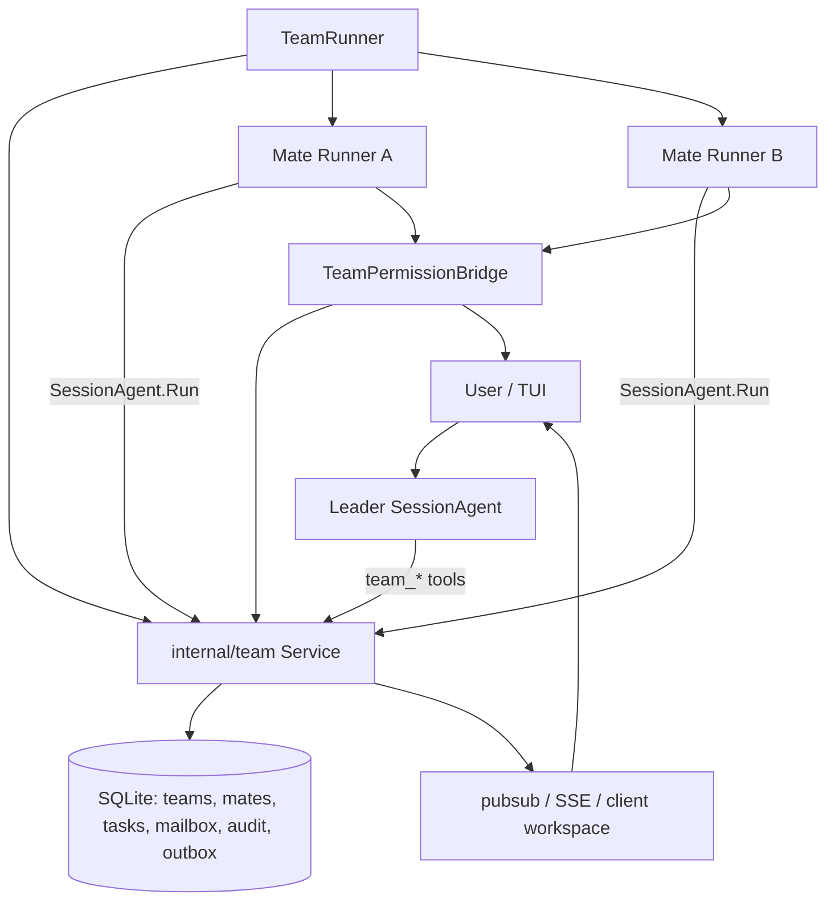

# 00 Notion 总入口：Crush AgentTeam 迁移技术报告

Source: https://www.notion.so/36e3d57b141780a7a27ef1a2b9682b23

## Document Map

| Module | Local copy | Focus |
| --- | --- | --- |
| Current state | `01-current-state.md` | Current `SessionAgent`, `Coordinator`, `agent` tool, session/message/db/event/TUI capabilities and gaps. |
| Target architecture | `02-target-architecture.md` | `internal/team`, DB schema, proto/API/SSE, workspace interface, event outbox. |
| Runtime protocol | `03-runtime-protocol.md` | `TeamRunner`, mate lifecycle, mailbox/task protocol, permission bridge, cancel/recovery. |
| A2A alternatives | `04-a2a-alternatives.md` | Why A2A should not be the first internal protocol and where it fits later. |
| Roadmap and tests | `05-roadmap-tests.md` | Phased implementation, touched files, acceptance criteria, tests, gates. |
| Dialectical review | `06-design-review.md` | Conflicting sub-agent viewpoints, objections, and final tradeoffs. |

## One-Sentence Conclusion

Crush currently has a short-lived sub-agent tool skeleton, but not a durable
teammate runtime. AgentTeam should not be implemented as "multiple Claude Code
processes" nor by expanding the existing `agent` tool into team mode. The
recommended path is:

1. Use a narrow in-memory runner spike to prove long-lived teammate lifecycle,
   cancel, flush, and UI observability.
2. Productize with a new `internal/team` domain layer backed by SQLite/sqlc for
   roster, mailbox, tasks, audit, and event outbox.
3. Let leader and mates collaborate through typed mailbox plus shared task
   board: similar to "email + ticket system + audit log", not normal chat.
4. Keep permissions user/UI-approved by default; the leader model must not
   automatically approve file writes or shell commands.
5. Start TUI with a compact team item and blocked/running summary, not a full
   command center.
6. Treat A2A as a future gateway for external/process-backed agents, not the
   first in-process internal protocol.

## Existing Crush Foundations

- `internal/agent/agent.go` has `activeRequests` and `messageQueue`, so turns
  from multiple sessions can coexist while prompts for the same session queue.
- `internal/agent/coordinator.go` has an `agents map[string]SessionAgent`, but
  only `currentAgent` is actually used as the front-line runtime.
- `internal/agent/agent_tool.go` creates child sessions and returns results
  synchronously through `runSubAgent`.
- `internal/session/session.go` has `ParentSessionID` and child session IDs tied
  to `messageID$$toolCallID`.
- `internal/app/app.go`, `internal/server/events.go`,
  `internal/client/proto.go`, and `internal/workspace/client_workspace.go`
  already provide a pubsub/SSE/client/TUI event chain.
- `internal/ui/model/ui.go` and `internal/ui/chat/agent.go` can display child
  tool calls under a parent message.

## Why This Is Not Team Mode Yet

| Current capability | Why it is insufficient |
| --- | --- |
| `agent` tool | Synchronous one-shot tool call, not a long-lived mate. |
| child session | Parent/child relationship only; no `team_id/mate_id/role/status`. |
| session `todos` | Single-session JSON; no owner, CAS, claim, dependency, or audit. |
| message history | Per-session conversation, not recipient/ack/correlation mailbox. |
| permission request | Session/tool/action/path only; no team/mate source or scope. |
| pubsub/SSE | Transport exists, but no `TeamEvent`, seq, replay, or snapshot. |
| nested tool UI | Can show child tool calls, not roster, blocked mate, team cancel. |

## Target Shape

Leader and mates still execute ordinary `SessionAgent` turns, but team state is
not a loose set of goroutines under `Coordinator`. It is a domain with durable
roster, mailbox, task, audit, and event contracts. A mate's normal assistant
output belongs to its own session; anything the leader must see goes through
`team_send_message`, `team_report_status`, or task state.

## Minimum Deliverable

1. Leader creates a team.
2. Leader spawns one in-process mate.
3. Mate has a stable `mate_id` and its own child/teammate session.
4. Leader creates and assigns a task.
5. Mate receives the task, claims it, and executes one turn.
6. Mate reports through `team_report_status` or `team_send_message`.
7. File-write or bash permission shows mate name, role, session, tool, path,
   and reason.
8. User allows once; mate continues.
9. Leader receives completion.
10. Audit records team/mate/task/permission/tool/action/path.
11. Existing single-agent chat, `agent` tool, SSE, and client workspace do not
    regress.
