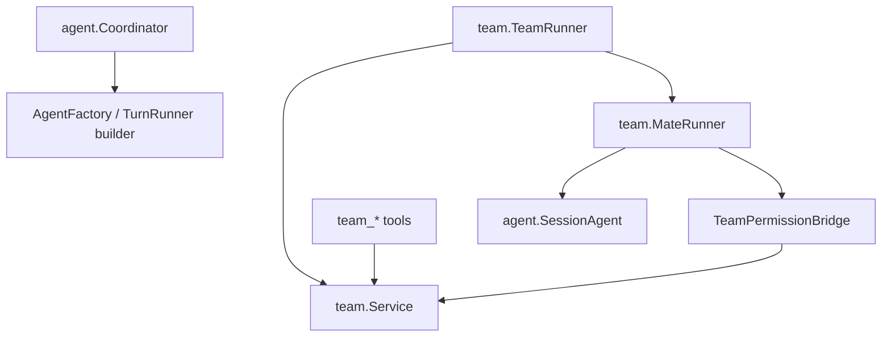
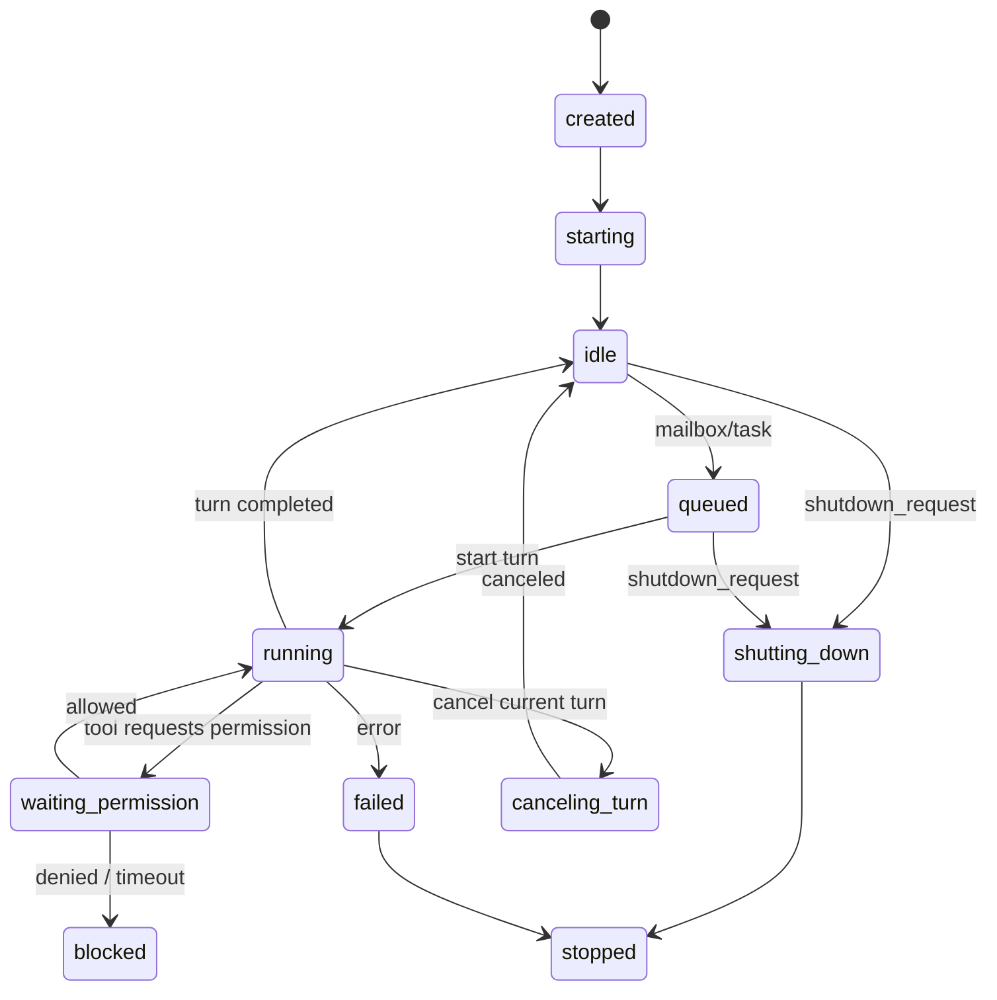

# 03 Notion：运行时与协作协议

Source: https://www.notion.so/36e3d57b1417805ba5b9f75c243ed1f1

## Mental Model

In-process teammate mode is not "start several Claude Code processes". It is:

```text
one Crush Go process
  one workspace/app
    one leader SessionAgent
    one TeamRunner
      multiple MateRunner goroutines
        each mate has its own SessionAgent or TurnRunner
        each mate has its own session_id
        shared state flows through team mailbox/task/audit
```

Leader and mate can interact, but not by sharing memory or broadcasting normal
assistant output. Interaction goes through typed protocol:

- `team_send_message`
- `team_report_status`
- `team_task_create/update/claim/list`
- `permission_request/permission_response`
- `shutdown_request/shutdown_approved`

The user-facing analogy is "email", but the engineering model is stricter:
email plus ticket system plus audit log plus permission workflow.

## Why `messageQueue` Is Not Mailbox

| Dimension | `SessionAgent.messageQueue` | team mailbox |
| --- | --- | --- |
| Key | session id | team id + recipient mate id |
| Lifetime | in-memory | DB in product mode |
| Type | `SessionAgentCall` | typed envelope |
| Ack | none | delivered/read |
| Correlation | none | required |
| Control message | none | permission/shutdown/task |
| Replay | none | required |
| UI/debug | queued prompt count | depth, blocked, last activity |

TeamRunner needs its own mailbox abstraction.

## Runtime Layers



Start with `SessionAgent` as the TurnRunner. Avoid over-abstracting provider,
model, tool, and prompt factory on day one.

## TeamRunner

```go
type TeamRunner interface {
    StartTeam(ctx context.Context, teamID string) error
    StopTeam(ctx context.Context, teamID string, mode StopMode) error
    SpawnMate(ctx context.Context, teamID string, mateID string) error
    StopMate(ctx context.Context, teamID, mateID string, mode StopMode) error
    CancelMateTurn(teamID, mateID string) error
    Status(teamID string) TeamRuntimeStatus
}
```

Rules:

- `CancelMateTurn` cancels the current `SessionAgent.Run` only.
- `StopMate` is graceful shutdown and stops accepting new work.
- `StopTeam` broadcasts shutdown and then force-cancels after timeout.
- App shutdown must stop team runners before closing DB.
- Stop/cancel must flush messages.

## MateRunner Loop

```text
start
  -> mark mate starting
  -> create/load mate session
  -> mark idle
  -> wait for:
       unread mailbox
       assigned task
       explicit wakeup
       cancel current turn
       shutdown
  -> build next prompt envelope
  -> mark running
  -> SessionAgent.Run(mateSessionID, prompt)
  -> flush messages
  -> mark idle / blocked / failed / stopped
  -> repeat
```

Key implementation notes:

- Use `NonInteractive: true` for mate turns to avoid normal foreground
  notifications.
- TeamRunner publishes `TeamEvent` instead.
- Do not treat queued `Run` as finished.
- Always `FlushAll` on stop/shutdown.

## Mate State Machine



State changes increment version and write outbox events. TUI reducer must process
events idempotently and pull snapshot on seq gap.

## Mailbox Envelope

```json
{
  "id": "msg_01",
  "team_id": "team_01",
  "from_mate_id": "leader",
  "from_role": "leader",
  "to_mate_id": "mate_researcher",
  "to_role": "researcher",
  "kind": "message",
  "correlation_id": "corr_01",
  "summary": "parser findings",
  "payload": {
    "text": "请分析 parser 的 error recovery 设计"
  },
  "created_at": 1779850000,
  "delivered_at": null,
  "read_at": null
}
```

MVP kinds:

```text
message
task_assignment
task_status
permission_request
permission_response
shutdown_request
shutdown_approved
```

Delay `mode_set` and plan approval protocol because Crush does not yet have a
real plan/mode state machine.

## Delivery Protocol

For normal message:

1. Resolve `to` to `mate_id`.
2. Write `team_mailbox_messages(kind=message)`.
3. Write outbox `mailbox.message_created`.
4. Wake mate runner.
5. Mate calls `ListUnread`.
6. Mate calls `MarkDelivered`.
7. Runner injects message into prompt.
8. After the turn consumes it, call `MarkRead`.

Control messages are handled by runner first. They should not be blindly passed
to the model.

## Team Tools

MVP tool names:

```text
team_create
team_spawn_mate
team_send_message
team_task_create
team_task_update
team_task_claim
team_task_list
team_report_status
team_shutdown_mate
```

Names must use the `team_` prefix to avoid confusion with existing `agent` and
`todos`.

## Permission Bridge

Default source fields:

```go
type PermissionSource struct {
    WorkspaceID     string
    TeamID          string
    MateID          string
    MateName        string
    MateRole        string
    SessionID       string
    ParentSessionID string
}
```

The bridge wraps existing permission service:

```text
tool requests permission
  -> bridge reads TeamIdentity from context
  -> no identity: base.Request
  -> identity exists:
       check team policy cache
       append permission_request mailbox/audit
       publish TeamEvent waiting_permission
       wait permission_response
       apply scope policy if allowed
       return decision
```

Do not let leader model approve by default. Future opt-in must be constrained,
expiring, and audited.

## Cancellation And Shutdown

| Action | Meaning | Implementation |
| --- | --- | --- |
| cancel mate turn | Stop current `SessionAgent.Run`; mate remains alive. | `turnRunner.Cancel(sessionID)` |
| clear mate queue | Clear unprocessed wakeups/prompt batch. | runner queue + mailbox read state |
| stop mate | Graceful shutdown; no new work. | mailbox `shutdown_request` + timeout |
| cancel team | Stop/cancel all mates under a team. | TeamRunner broadcast |

Existing `AgentCoordinator.Cancel(sessionID)` is insufficient because it does
not update team/mate status or know team scope.

## Cost And File Coordination

Initial cost should stay on mate sessions. Later phases can aggregate
`team_usage_events` or snapshot from session usage.

File writes need coordination because filetracker does not prevent:

```text
Mate A read foo.go at v1
Mate B read foo.go at v1
Mate A write foo.go -> v2
Mate B write foo.go based on v1 -> overwrite A
```

Phased direction:

- Show recent same-path writes in permission UI.
- Add `team_file_locks`.
- Add write-before-check using file hash.

## Prompt Addendum

Leader must know:

- Use `team_task_*` for shared work.
- Use `team_send_message` for mate communication.
- Do not assume mate normal output is visible.
- Do not use existing `agent` tool as persistent teammate.
- Default permission approvals to one-shot.

Mate must know:

- Normal output is local to its own session.
- Report progress/blockers/completion through team tools.
- Claim tasks before work.
- Use `expected_version` for shared task updates.
- On denied permission, report alternative instead of retrying blindly.
- On shutdown, stop new work and respond through protocol.
