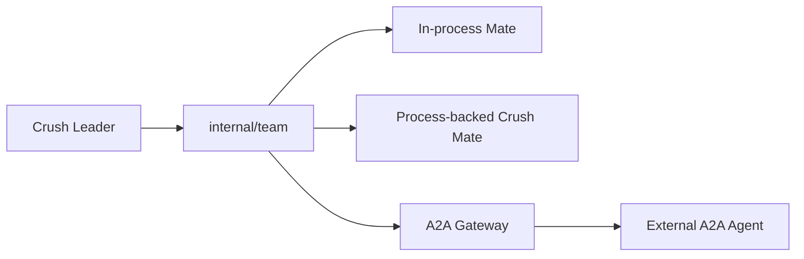

# 04 Notion：A2A 与替代方案评估

Source: https://www.notion.so/36e3d57b141780838af7f2e586bfed3a

## What A2A Solves

A2A is an Agent2Agent interoperability protocol. It focuses on:

- Agent Card: capabilities, endpoint, auth, skills.
- Task: a unit of collaboration between client and remote agent.
- Message: user/agent message exchange.
- Part/Artifact: content and outputs.
- TaskState: submitted, working, input-required, completed, failed, canceled.
- Transport: JSON-RPC over HTTP, streaming, push notification.

It answers:

```text
How can an external client discover, call, and track another agent service?
```

It does not answer:

```text
How should a local TUI agent product manage multiple in-process goroutine mates,
reuse SQLite/sqlc/session/message/permission/hook/TUI, and enforce local file
permission and audit?
```

## Why Not First

Crush Team mode first needs:

- mate lifecycle
- session/message flush
- permission source
- local file edit/write/batch safety
- TUI blocked/running/debug
- SQLite task/mailbox CAS
- backend workspace isolation

A2A does not define:

- how `permission.Request` displays mate name
- how `team_task_claim` performs atomic update
- when `message.Service.FlushAll` is called
- how `Coordinator.currentAgent` avoids background mate pollution
- how TUI child-session nested tools update

## A2A Cannot Replace Native DB Domain

Team mode still needs native tables:

```text
teams
team_mates
team_tasks
team_mailbox_messages
team_audit_events
team_event_outbox
```

A2A Task/Message can be mapped at the boundary, but using A2A as internal schema
would either lose local fields or force a second internal domain later.

## Permission Mismatch

Crush permissions are local development permissions:

- read/list outside working dir
- write/edit/multiedit
- bash execute
- MCP tool call
- download/fetch

These are bound to path/action/tool_call_id/session/team/mate. A2A does not
model one-shot/session/agent/team scope, hook preapproval, path policy, input
hash, or audit decision source. Permission bridge must be native.

## In-Process Resource Sharing

In-process mates share:

- `sql.DB`
- `message.Service`
- `session.Service`
- `permission.Service`
- `lsp.Manager`
- MCP state
- filetracker
- hook runner
- skills manager

A2A's remote-agent boundary does not manage Go process shared-service contention.

## Where A2A Fits Later



Mapping:

| Crush domain | A2A concept |
| --- | --- |
| `team_mates.agent_profile` | Agent Card / skill selection |
| `team_tasks` | A2A Task |
| `team_mailbox_messages(kind=message)` | A2A Message |
| `team_task.status` | TaskState |
| future `team_artifacts` | A2A Artifact |
| `team_event_outbox` | streaming/push source |

## Alternative Evaluation

| Alternative | Verdict |
| --- | --- |
| JSON file mailbox | Good for lightweight scripts; poor fit for Crush because it already has SQLite/sqlc, server/client mode, pubsub, and needs CAS/audit/replay. |
| Pure in-memory mailbox | Good for runtime spike only; not product MVP because restart/replay/audit/debug break. |
| Direct session messages | Pollutes conversations and lacks recipient/read/ack/control/correlation. |
| Put TeamRunner into Coordinator | Too much semantic pollution around `currentAgent`, `CancelAll`, `IsBusy`, `Model`, `QueuedPrompts`. |
| Multi-process first version | Strong isolation but too costly early: DB locks, forwarding, crash recovery, sockets, env/cwd, process lifecycle. |
| Full TUI command center | Too much information and too many brittle layout tests before event contract is stable. |

Final direction:

```text
native internal/team domain
  -> SQLite/sqlc truth source
  -> in-process TeamRunner
  -> workspace/proto/SSE/TUI contract
  -> later process backend
  -> later A2A gateway
```
