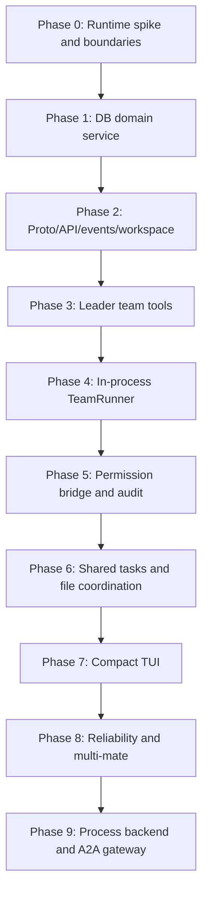

# 05 Notion：多期实施路线与测试策略

Source: https://www.notion.so/36e3d57b1417803f86c3f084df7f4045

## Overall Route



Strategy: falsify the runtime first, then productize durable protocol.

## Phase 0: Runtime Spike And Boundaries

Goals:

- Do not change DB first.
- Do not expose to normal users.
- Prove one long-lived mate goroutine can start/send/cancel/stop/flush.
- Find real conflicts between `SessionAgent.Run` and long-lived runner.

Touched files:

```text
internal/team/runner.go
internal/team/mate_runner.go
internal/team/models.go
internal/agent/coordinator.go
internal/agent/agent.go
internal/app/app.go
```

Can use in-memory mailbox:

```go
type InMemoryMailbox struct {
    ch chan TeamPrompt
}
```

Must verify:

- mate has independent session.
- mate `SessionAgent.Run` does not block leader.
- busy mate does not swallow prompt.
- cancel current turn allows future prompts.
- stop calls cancel, wait, and `FlushAll`.
- app shutdown does not leak goroutines.

Do not do DB mailbox, task board, permission bridge, multi-mate, or full TUI.

## Phase 1: DB Domain Service

Goals:

- Establish product truth source.
- Do not connect real runner yet.
- Harden schema, sqlc, and transaction design.

Tables:

- `teams`
- `team_mates`
- `team_tasks`
- `team_task_dependencies`
- `team_mailbox_messages`
- `team_audit_events`
- `team_event_outbox`

Critical tests:

- concurrent `ClaimNextTask` succeeds for only one mate.
- `UpdateTask` version conflict returns explicit error.
- soft delete excludes stale rows from active indexes.
- every write creates audit/outbox.

## Phase 2: Proto/API/Events/Workspace Contract

Goals:

- Local workspace and server/client workspace share one contract.
- TUI can remain debug-only.
- TeamEvent round-trip works.

Need:

```text
internal/proto/team.go
PayloadTypeTeamEvent = "team_event"
AppWorkspace + ClientWorkspace support
Team snapshot/debug routes
```

Gate: do not implement AppWorkspace only.

## Phase 3: Leader Team Tools

Tools:

```text
team_create
team_spawn_mate
team_send_message
team_task_create
team_task_update
team_task_list
team_report_status
team_shutdown_mate
```

Descriptions must distinguish:

- `agent` tool = one-shot delegated task.
- `team_spawn_mate` = long-lived teammate.
- `todos` = private todo list.
- `team_task_*` = shared task board.

## Phase 4: In-Process TeamRunner Productization

End-to-end:

```text
leader creates team
leader spawns researcher
leader sends message
researcher receives message
researcher runs one turn
researcher reports status
leader can list mailbox/status
stop mate flushes messages
```

Gate:

- queued `Run` returning `nil,nil` is handled correctly.
- app shutdown stops TeamRunner.

## Phase 5: Permission Bridge And Audit

Goals:

- Permission UI shows who is asking.
- Default one-shot.
- Every request/decision is audited.

Minimum:

- Extend permission request fields compatibly.
- Read `TeamIdentity` from context.
- Show mate badge in request UI.
- Grant/Deny by request id.
- Audit `permission.requested/allowed/denied`.

## Phase 6: Shared Task Board And File Coordination

Goals:

- Multi-mate collaboration around shared tasks.
- CAS claim/update.
- Initial prevention against file overwrite.

Implement:

- mandatory `expected_version`
- atomic `ClaimNextTask`
- assignment -> mailbox `task_assignment`
- `team_report_status` updates current task
- optional `team_file_locks`

## Phase 7: Compact TUI

Start with:

- one parent chat `Team` item
- collapsed summary: team name, running/blocked/done, cost, last activity
- expanded rows: `role/name | state | current tool | elapsed | cost | permission?`
- actions: cancel team, cancel mate, debug snapshot, copy trace id

Do not start with a complex dashboard.

## Phase 8: Reliability And Multi-Mate

Add:

- event seq/replay
- debug snapshot
- queue depth and idle age
- mate max concurrency
- permission queue limiting
- runaway detector
- cost/token aggregation

## Phase 9: Process Backend And A2A Gateway

Process backend:

- child `crush` server/workspace
- HTTP/SSE forwarding
- permission forwarding
- DB lock strategy
- crash recovery
- env/cwd isolation

A2A gateway:

- Agent Card -> `agent_profile`
- A2A Task -> `team_task`
- A2A Message -> `team_mailbox_message`
- A2A Artifact -> future `team_artifacts`
- A2A streaming -> `team_event_outbox`

Only after native in-process team is stable.

## Test Matrix

| Layer | Tests |
| --- | --- |
| DB/sqlc | migration, atomic claim, CAS, partial index |
| Service | team create, mate spawn, mailbox ack, task update, audit/outbox |
| Runtime | mate loop, cancel, shutdown, flush, queued prompt |
| Permission | source metadata, scope, deny, audit, hook |
| Proto/SSE | wrap/unwrap, unknown type, workspace isolation |
| ClientWorkspace | proto/internal translation |
| TUI reducer | idempotency, event gap, snapshot recovery |
| Integration | leader spawn mate E2E, multi-workspace, multi-mate |
| Regression | existing `agent` nested UI, single chat, permission dialog |

## Invariants

1. Single-agent chat does not depend on team package.
2. Existing `agent` tool behavior is unchanged.
3. Dropped team events cannot lose DB state.
4. Every write has audit.
5. Non-one-shot permission is path/tool/action constrained.
6. Mate normal assistant output is not a message to leader.
7. `CancelTeam` is not server shutdown.
8. `message.Service.FlushAll` runs on runner stop/shutdown.
9. Server/client and local mode are both supported.
10. TUI can repair event gaps with snapshot.
